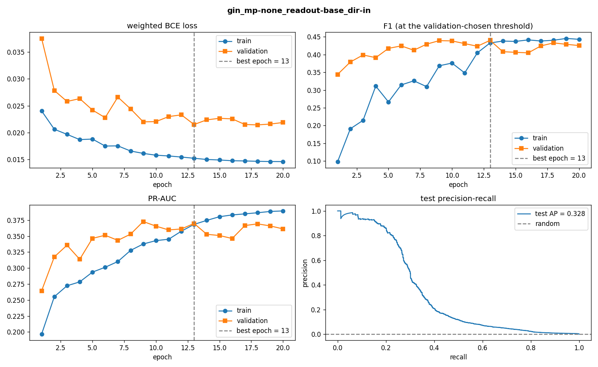
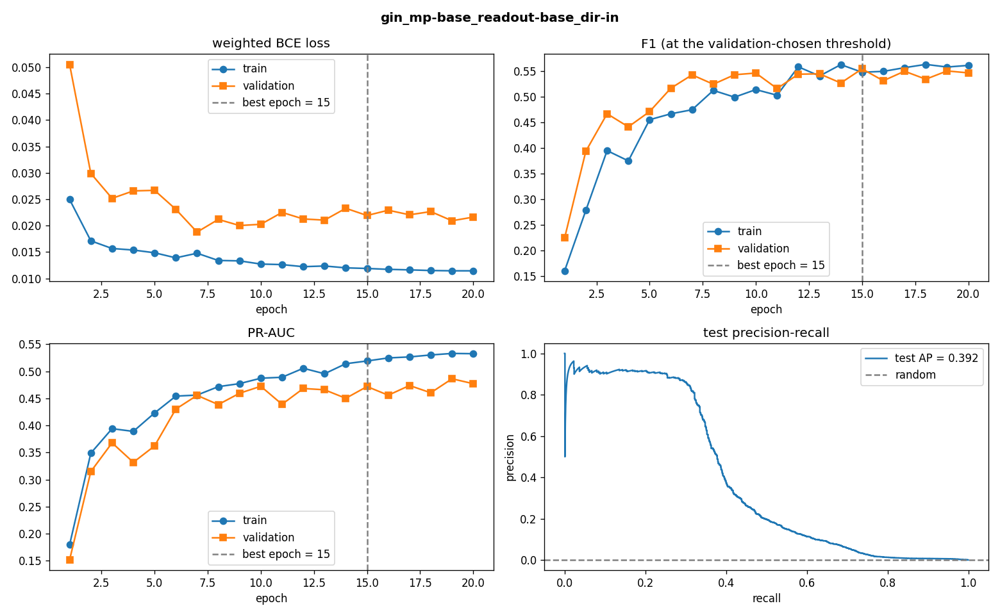
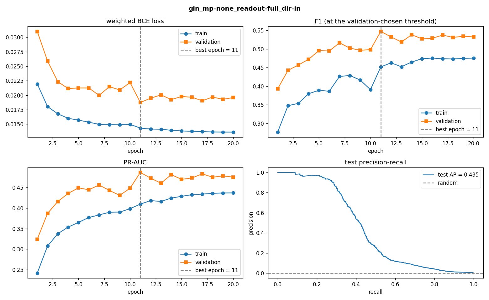
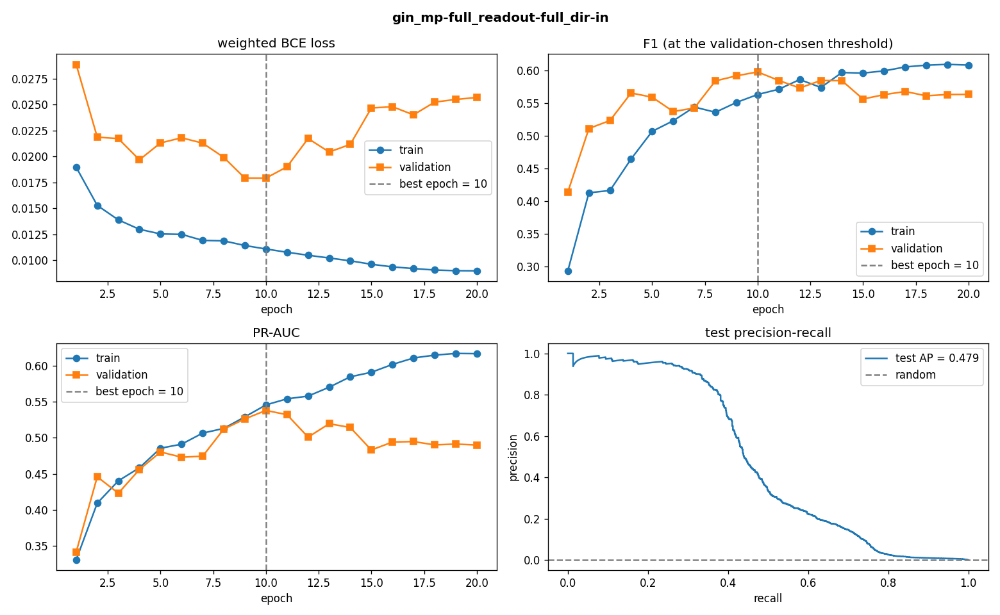
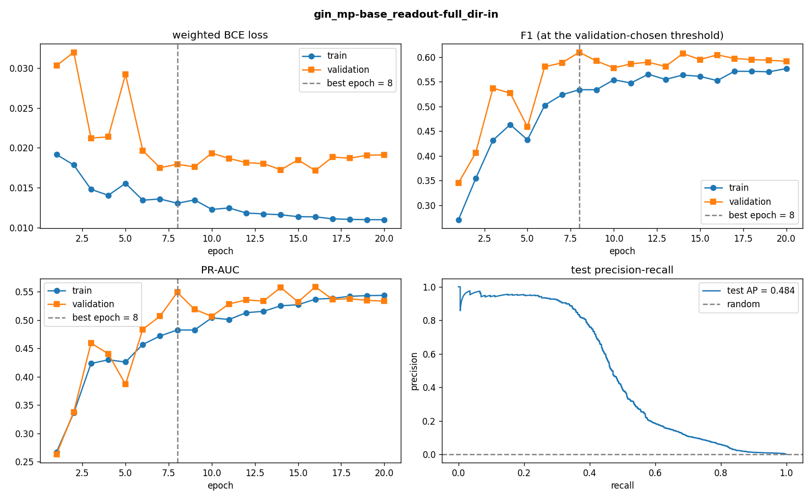
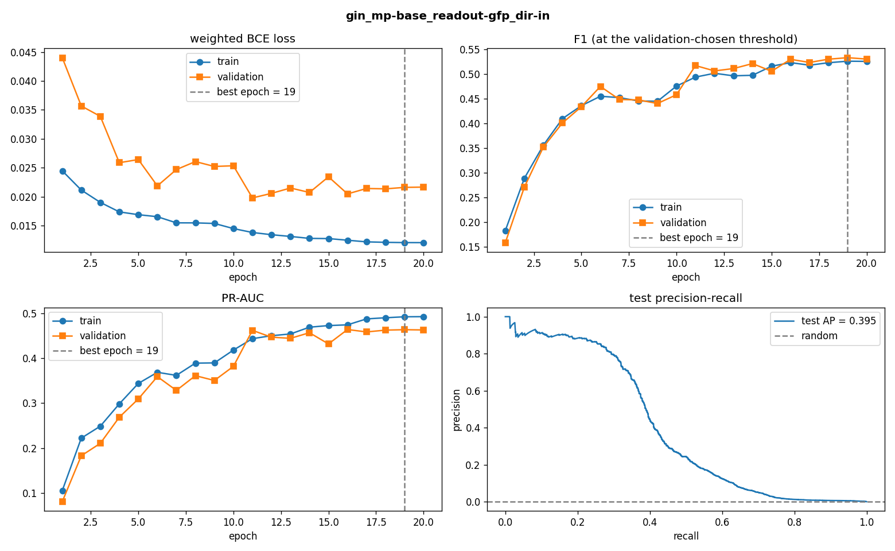
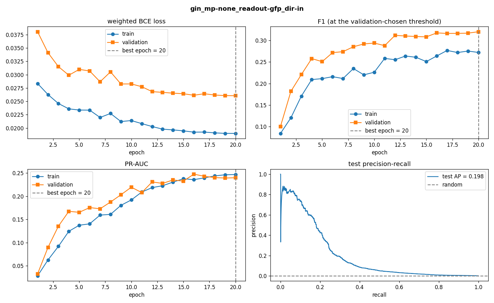

# gnn_for_fraudulent_patterns — documentation

*Mirror of the Notion documentation page (the main copy). Section numbers match it.*

## Overview

Master thesis: **does manual feature engineering help Graph Neural Networks detect money
laundering?** We build a leakage-checked pipeline on the IBM AML **HI-Small** dataset, engineer
transaction and structural (GFP) features, and compare GNN variants (GIN/GINE, PNA, GATv2) under
a strictly **fixed architecture**, so any performance difference is attributable to the features,
not to model changes.

Code: [GitHub repo](https://github.com/sandrokhizanishvili/gnn_for_fraudulent_patterns/tree/main) ·
Task list: `EXPERIMENTS.md` / [Notion experiments page](https://app.notion.com/p/3e011ae27ef280889f9cd78f4cfb1a78)

## 1 · Dataset

| Property | Value |
|---|---|
| Source | IBM Transactions for AML (Altman et al., NeurIPS 2023) [[1]](#references), HI-Small variant |
| Transactions | 5,078,345 raw → **5,077,237** after truncation at Sep 10 |
| Laundering | **4,522** (0.089%) — 1 : 1,120 imbalance |
| Accounts (nodes) | 515,070 |
| Time span | 2022-09-01 → 2022-09-10 (the creator confirms later days contain only laundering-pattern completions [[3]](#references); the dropped tail was 59% laundering and would poison the temporal test split) |
| Currencies | 15, converted to USD with day-specific Yahoo Finance rates [[7]](#references) |
| Ground truth patterns | 370 annotated laundering attempts across 8 typologies (cycle, fan-in/out, scatter-gather, stack…) |

## 2 · Features

Node features describe the account, baseline edge features describe the transaction; every edge
feature is kept because it shows a measured signal on HI-Small (base laundering rate 0.089 %).
The 61 GFP structural edge features are covered in §3.

**Node features — 6 per account**

| Feature | What it is | How it is computed |
|---|---|---|
| `EntityType_*` — 6 one-hot columns: Corporation, Individual, Partnership, Sole, Country, Direct | the kind of account holder — the only account attribute the dataset provides | first word of the entity name in `HI-Small_accounts.csv` ("Corporation #33520" → Corporation), one-hot encoded; accounts that appear only in transactions get an all-zero vector |

Everything else the model knows about an account comes from message passing over its transactions.

**Baseline edge features — 20 per transaction**

| Feature | What it captures | How it is computed | Evidence on HI-Small |
|---|---|---|---|
| `Amount_Log` | transaction size | amount × day-specific FX rate to USD (Yahoo Finance; USD rows 1.0), then log1p | heavy tail becomes roughly log-normal |
| `Struct_Band` | structuring just below the $10k reporting threshold | 1 if the USD amount is in [9,000, 10,000] | 0.275 % laundering — 3.1× lift |
| `Hour_Sin`, `Hour_Cos` | time of day, cyclic | sin / cos of 2π · hour / 24 | midday peak 0.17 % |
| `DayOfWeek_Sin`, `DayOfWeek_Cos` | day of week, cyclic | sin / cos of 2π · weekday / 7 | Sunday 0.31 % ≈ 3× weekdays |
| `Is_Weekend` | weekend flag | 1 on Saturday / Sunday | same signal as above |
| `Is_Self_Loop` | account pays itself | 1 if sender account = receiver account | near-zero laundering risk |
| `Same_Bank` | intra-bank transfer | 1 if sender bank = receiver bank | 0.012 % same-bank vs 0.101 % cross-bank — 8× separation |
| `Dt_Src_Log` | sender burstiness | log1p of the seconds since the sender's previous transaction; first transaction → 10 days | laundering senders burst: median gap 0.0 h vs 0.3 h |
| `Dt_Dst_Log` | receiver dormancy | same for the receiver | receivers are dormant mules: 8.2 h vs 0.4 h |
| `Src_Bank_Risk`, `Dst_Bank_Risk` | how risky the sender's / receiver's bank is | smoothed laundering rate of the bank (m = 200 towards the train prior). Train rows use only strictly earlier transactions of that bank; val / test rows use the rate frozen from the train window; unseen banks get the prior — no label leaks into its own feature | 30k banks; rates 0 % → 0.68 % among large banks |
| `PayFmt_*` — 7 one-hot columns | payment channel | one-hot of Payment Format: ACH, Bitcoin, Cash, Cheque, Credit Card, Reinvestment, Wire | ACH 0.75 % = 7× average |

**Dropped by evidence:** `Currency_Mismatch` (zero positives in its 1.4% share), `Is_ACH`
(duplicate of the one-hot), `Bank_ID_Norm` (meaningless ordinal), round-amount flags (don't occur
in this data).

**Leakage rule:** every feature and every fitted quantity (bank rates, normalisation, thresholds)
uses only the past or the training window; GFP causality is handled in §3; test is scored once.

## 3 · GFP configuration & variants

IBM's Graph Feature Preprocessor turns each transaction's graph neighbourhood into numbers,
computed causally in batches of 128 (see the pitfalls below). **V0** is the paper's configuration and feeds every
result so far; the four variants are computed (`Data/gfp_variants/`) but not yet trained on.
"= V0" means unchanged.

| Feature group | What it measures for each transaction | V0 (paper) | win48 | win120 | lc10 | rich |
|---|---|---|---|---|---|---|
| Scatter-gather (3 bins) | gather-then-scatter patterns the transaction belongs to, counted by pattern size [2–3, 3–5, 5+] | window 6 h | 12 h | 24 h | = V0 | = V0 |
| Temporal cycles (3 bins) | time-ordered cycles the transaction closes, by cycle length [2–3, 3–5, 5+] | window 24 h | 48 h | 120 h | = V0 | = V0 |
| Simple cycles (3 bins) | length-limited cycles the transaction closes, by cycle length | window 24 h, length ≤ 6 | 48 h | 120 h | length ≤ 10 | = V0 |
| Vertex statistics (52) | for sender and receiver, incoming and outgoing: fan, degree, ratio, and avg / sum / var / skew / kurtosis of the timestamps and amounts (2 × 2 × 13) | window 24 h | 48 h | 120 h | = V0 | + min / max / median → 2 × 2 × 19 = 76 |
| Fan / degree histograms | number of counterparties (fan) and of transactions (degree) of the accounts, in and out, by bin | off | off | off | off | on, bins [2, 4, 8, 13], 24 h → 16 |
| Graph memory (`time_window`) | how far back edges stay in snapml's graph; caps every window above it | 24 h | 48 h | 120 h | 24 h | 24 h |
| Features per transaction | | **61** | 61 | 61 | 61 | **101** |

**Why the variants:** HI-Small's 370 laundering attempts are slower than the paper's windows —
21 % finish within 24 h, 37 % of cycles exceed 6 hops. win48 covers 84 % of hop-to-hop gaps
(V0: 52 %), win120 covers 90 % of attempt durations, lc10 covers 49 of 54 observed cycles, rich
takes its bins from the data's fan-degree quartiles. Longer windows already correlate more with
the label (cycle features +0.064 → +0.097). Next step: retrain the best model with each variant,
nothing else changed.

**Two snapml pitfalls, found by our checks and fixed:**

- snapml drops edges older than the global `time_window` from its internal graph, so a
  per-pattern window longer than it has no effect (verified: with `time_window` left at 24 h,
  the 48 h cycle features came out identical to the 24 h ones). The long-window variants
  therefore raise `time_window` to their largest pattern window.
- `fit_transform` on the whole dataset at once leaks future information: an account's first
  transaction saw out-degrees up to 176,127 (its whole future; `fit` and `transform` also each
  insert the batch). Fixed by streaming the time-sorted edges through `transform` in batches of
  128 as in the paper: 99.02 % of first transactions are now perfectly causal, worst case
  degree 9.

## 4 · Graph & splits

Directed temporal multigraph — nodes = accounts, edges = transactions; task = **edge
classification**. Cumulative snapshots (paper protocol): context edges carry label −1 and are
excluded from loss/metrics but visible to message passing.

| Snapshot | Edges in the graph | Evaluated edges | Evaluated window (2022) | Laundering among evaluated |
|---|---|---|---|---|
| train | 3,046,342 (train only) | 3,046,342 (all) | Sep 1 00:00 → Sep 6 13:34 | 2,297 (0.075 %) |
| val | 4,061,789 (train + val) | 1,015,447 (val part) | Sep 6 13:34 → Sep 8 16:09 | 1,082 (0.107 %) |
| test | 5,077,237 (all) | 1,015,448 (test part) | Sep 8 16:09 → Sep 10 23:59 | 1,143 (0.113 %) |

The split is positional over the time-sorted stream, so a boundary falls inside a minute: the
last train edge and the first val edge share the timestamp Sep 6 13:34, likewise Sep 8 16:09
between val and test.

## 5 · Models — four operators

One template for every operator (`gnn_core.py`); only the aggregation rule inside the
message-passing box differs. The table lists what is fixed and the knobs that may change.

| Fixed for every run | Value |
|---|---|
| Template | input projection → 2 message-passing layers (residual, dropout) → readout MLP |
| Width / dropout | hidden **128** · dropout 0.3 — 128 rather than the paper's 64 so the 81 features are never compressed; fixed a priori |
| Readout | concat `[h_src ‖ h_dst ‖ e_seed]` → Linear 128 → ReLU → Dropout → Linear 1 |
| Neighbour sampling | `LinkNeighborLoader` · ≤ 100 neighbours per hop · 2 hops · 8,192 seed edges per batch |
| Loss | `BCEWithLogitsLoss`, pos_weight = 8 |
| Optimizer | Adam · lr 1e-3 · weight decay 1e-5 · cosine schedule · 20 epochs |
| Seed | 42 (seed sweep on the winners later) |
| Invariant parameters | GIN **67,587** · GATv2 **67,585** — identical across feature configs within a family, verified every run; only the edge projections and the readout input widen |
| Knobs — all that may change | `OPERATOR` gin / pna / gat / transformer · `MP_EDGE_FEATS` none / base / full · `READOUT_EDGE_FEATS` base / full / gfp · `MP_DIRECTION` in / bidirectional · `TEMPORAL_SAMPLING` on / off |

### 5.1 GIN / GINE — sum aggregation

- Rule: `h_v ← MLP((1 + ε)·h_v + Σ m_u)` with learnable ε; the sum keeps multiset counts, so
  five incoming payments look different from two (Xu et al. 2019 [[8]](#references)).
- Node MLP `Linear → BatchNorm → ReLU → Linear`; BatchNorm tames the summed activations of hub
  accounts (degree up to 168k).
- Edge features: `GINConv` when none enter message passing; `GINEConv` otherwise, with
  `m_u = ReLU(h_u + W_e·e_uv)` — `W_e` (128 × edge width) is the only extra weight.
- Invariant parameters 67,587. **Status: 7 runs done → §7.**

### 5.2 GATv2 — attention aggregation

- Rule: each neighbour message is weighted by a learned attention score that depends on both
  endpoints (GATv2, Brody et al. 2022 [[9]](#references), fixes the static-attention limit of
  the original GAT).
- 4 heads × 32 = 128, concatenated; edge features enter the attention score and the message via
  `edge_dim` — `lin_edge` is the only width-dependent tensor.
- Same two-layer template, residual, dropout; invariant parameters 67,585 (attention vectors
  and biases replace the GIN MLP).
- Kaggle memory: four heads over `[100, 100]` neighbourhoods may not fit at batch 8,192; then the
  8,192 seeds arrive as two sampled micro-batches per optimizer step (`ACCUM_STEPS = 2`) — the
  same update, recorded in `results.json`.
- Status: notebook `GAT_fixed_architecture.ipynb` ready with the seven configs; **batch not yet
  run**.

### 5.3 PNA — several aggregators at once

- Rule: mean, max, min and std of the messages, each rescaled by degree scalers (identity,
  amplification, attenuation) computed from the training-graph in-degree histogram (Corso et
  al. 2020 [[10]](#references)); more expressive than a single sum for continuous features.
- Edge features via `edge_dim`; `towers = 1`; same width 128 and depth 2.
- The degree histogram is computed on the train graph only, never on val/test.
- **Status: planned, 7 runs.**

### 5.4 Graph Transformer — attention with edge features

- Rule: PyG `TransformerConv` (Shi et al. 2021 [[11]](#references)) — multi-head dot-product
  attention between a node and its sampled neighbours, with edge features added to keys and
  values.
- 4 heads × 32 = 128, mirroring GATv2 so the two attention operators differ only in the
  attention mechanism.
- Local attention over the sampled `[100, 100]` neighbourhood, not a full-graph transformer
  (infeasible at 5M edges); stated as a limitation.
- **Status: planned, 7 runs.**

## 6 · Evaluation protocol

- **Threshold:** swept on validation each epoch (best-F1 point); the best-val-F1 checkpoint and
  its threshold are kept. Each model gets its own threshold by the same procedure.
- **Test is scored once** with that checkpoint and threshold; no decision is ever made on test.
- **Every metric on train, val and test** (thresholded ones at the validation threshold), saved
  as `<split>_<metric>` in `results.json` and `batch_summary.csv`; `predictions.csv` keeps every
  scored edge (`edge_id`, probability, predicted class).
- **Curves per run:** train/val loss, F1 and PR-AUC per epoch with a dashed line at the saved
  epoch, plus the test precision–recall curve.

| Metric | What it measures | Role |
|---|---|---|
| **F1** | minority-class F1 at the validation threshold | headline metric, decides rankings |
| Precision / Recall | at the same threshold | the trade-off behind F1 |
| PR-AUC | threshold-free ranking quality on the laundering class | robustness check |
| ROC-AUC | threshold-free, both classes | reported only — 0.94–0.98 for every run, uninformative at 1 : 1,000 |
| Precision@5 % | precision when the top 5 % highest-scored transactions are flagged; ceiling = prevalence / 0.05 (0.015 train, 0.021 val, 0.023 test) | reported only — near its ceiling for every run |
| Recall@5 % | share of all laundering caught inside that top 5 % | operating point for a fixed alert budget |

## 7 · Results — message passing × data variants

One subsection per operator family; inside it one subsection per run (the seven feature
configurations of §5), then the family's best configuration. Every run: 20 epochs, threshold
chosen on validation, best-val-F1 checkpoint, test scored once; thresholded metrics on all three
splits use that threshold. Recall@5 % = share of laundering inside the top-5 % highest-scored
edges. Artifacts in `Outputs/<FAMILY>/<run>/`.

### 7.1 GIN family (hidden 128, dir=in, seed 42; batch of 26 Sep 2026)

`invariant_params` = **67,587** in every run; training logs in the executed
`GIN_fixed_architecture.ipynb`.

#### 7.1.1 GIN-1 · none / base — topology alone, the reference point

Best epoch 13 · threshold 0.502 · params 103,043 · `Outputs/GIN/gin_mp-none_readout-base_dir-in/`

| Split | F1 | Precision | Recall | PR-AUC | ROC-AUC | Precision@5 % | Recall@5 % |
|---|---|---|---|---|---|---|---|
| train | 0.432 | 0.555 | 0.354 | 0.368 | 0.982 | 0.0129 | 0.853 |
| val | 0.439 | 0.694 | 0.321 | 0.370 | 0.975 | 0.0175 | 0.824 |
| test | **0.371** | 0.481 | 0.302 | 0.328 | 0.972 | 0.0183 | 0.814 |

- No edge features in message passing; the classifier sees the 20 baseline features. The anchor
  every uplift is measured against.

#### 7.1.2 GIN-2 · base / base — edge features inside message passing

Best epoch 15 · threshold 0.486 · params 108,419 · `Outputs/GIN/gin_mp-base_readout-base_dir-in/`

| Split | F1 | Precision | Recall | PR-AUC | ROC-AUC | Precision@5 % | Recall@5 % |
|---|---|---|---|---|---|---|---|
| train | 0.548 | 0.650 | 0.474 | 0.519 | 0.989 | 0.0136 | 0.905 |
| val | 0.554 | 0.846 | 0.411 | 0.472 | 0.970 | 0.0167 | 0.783 |
| test | **0.456** | 0.659 | 0.348 | 0.392 | 0.961 | 0.0174 | 0.771 |

- +0.085 F1 over GIN-1 from the same 20 features entering the convolutions (RQ1); precision
  0.48 → 0.66, recall +0.05.

#### 7.1.3 GIN-3 · none / base+GFP — GFP only at the decision layer

Best epoch 11 · threshold 0.561 · params 110,851 · `Outputs/GIN/gin_mp-none_readout-full_dir-in/`

| Split | F1 | Precision | Recall | PR-AUC | ROC-AUC | Precision@5 % | Recall@5 % |
|---|---|---|---|---|---|---|---|
| train | 0.453 | 0.565 | 0.377 | 0.410 | 0.984 | 0.0132 | 0.875 |
| val | 0.548 | 0.813 | 0.413 | 0.487 | 0.981 | 0.0184 | 0.861 |
| test | **0.471** | 0.635 | 0.375 | 0.435 | 0.980 | 0.0194 | 0.861 |

- +0.100 F1 over GIN-1 from the 61 GFP features at the readout alone (RQ2) — more than base
  features in message passing gave (GIN-2).

#### 7.1.4 GIN-4 · base+GFP / base+GFP — GFP everywhere

Best epoch 10 · threshold 0.568 · params 131,843 · `Outputs/GIN/gin_mp-full_readout-full_dir-in/`

| Split | F1 | Precision | Recall | PR-AUC | ROC-AUC | Precision@5 % | Recall@5 % |
|---|---|---|---|---|---|---|---|
| train | 0.563 | 0.692 | 0.475 | 0.546 | 0.991 | 0.0140 | 0.928 |
| val | 0.598 | 0.831 | 0.467 | 0.538 | 0.979 | 0.0178 | 0.837 |
| test | **0.512** | 0.743 | 0.390 | 0.479 | 0.974 | 0.0186 | 0.827 |

- Second best; the highest test precision of the family (0.743) at lower recall. The one clear
  overfitter: validation loss rises from epoch 10 while train PR-AUC climbs to 0.62 (val 0.49)
  by epoch 20; the checkpoint at epoch 10 was taken before the damage.

#### 7.1.5 GIN-5 · base / base+GFP — GFP at the decision layer only

Best epoch 8 · threshold 0.504 · params 116,227 · `Outputs/GIN/gin_mp-base_readout-full_dir-in/`

| Split | F1 | Precision | Recall | PR-AUC | ROC-AUC | Precision@5 % | Recall@5 % |
|---|---|---|---|---|---|---|---|
| train | 0.534 | 0.666 | 0.445 | 0.482 | 0.986 | 0.0134 | 0.886 |
| val | 0.609 | 0.820 | 0.484 | 0.549 | 0.983 | 0.0184 | 0.864 |
| test | **0.525** | 0.678 | 0.429 | 0.484 | 0.980 | 0.0195 | 0.867 |

- Best of the family: +0.154 over GIN-1, best recall (0.429) and best Recall@5 % (0.867);
  validation loss flat after epoch 8, no overfitting.

#### 7.1.6 GIN-6 · base / GFP only — are raw features redundant once message passing has used them?

Best epoch 19 · threshold 0.646 · params 113,667 · `Outputs/GIN/gin_mp-base_readout-gfp_dir-in/`

| Split | F1 | Precision | Recall | PR-AUC | ROC-AUC | Precision@5 % | Recall@5 % |
|---|---|---|---|---|---|---|---|
| train | 0.526 | 0.707 | 0.418 | 0.492 | 0.989 | 0.0137 | 0.911 |
| val | 0.533 | 0.678 | 0.439 | 0.464 | 0.971 | 0.0171 | 0.801 |
| test | **0.440** | 0.507 | 0.388 | 0.395 | 0.961 | 0.0173 | 0.770 |

- No: dropping the 20 baseline features from the readout costs 0.085 against GIN-5 and even
  0.016 against GIN-2. Still improving at epoch 19, threshold 0.65.

#### 7.1.7 GIN-7 · none / GFP only — GFP alone vs baseline alone

Best epoch 20 · threshold 0.685 · params 108,291 · `Outputs/GIN/gin_mp-none_readout-gfp_dir-in/`

| Split | F1 | Precision | Recall | PR-AUC | ROC-AUC | Precision@5 % | Recall@5 % |
|---|---|---|---|---|---|---|---|
| train | 0.273 | 0.686 | 0.170 | 0.247 | 0.965 | 0.0118 | 0.780 |
| val | 0.319 | 0.458 | 0.245 | 0.239 | 0.955 | 0.0164 | 0.771 |
| test | **0.256** | 0.265 | 0.248 | 0.198 | 0.941 | 0.0164 | 0.731 |

- Worst of the family: the 61 GFP features alone at the readout (0.256) are far below the 20
  baseline features alone (GIN-1, 0.371). GFP complements the baseline features, it does not
  replace them. Still improving at epoch 20, threshold 0.69.

#### 7.1.8 Best of the GIN family

Ranked by test F1. Precision, recall, PR-AUC, Precision@5 % and Recall@5 % are **test** values at
the validation threshold. Precision@5 % is bounded by prevalence / 0.05 — 0.015 on train, 0.021
on val, 0.023 on test: a 5 % alert budget is ~45× the laundering share, so every run sits near
the ceiling and the column cannot separate models; Recall@5 % is the informative operating-point
number.

| Run | mp / readout | best ep | F1 train | F1 val | F1 test | Precision | Recall | PR-AUC | Precision@5 % | Recall@5 % |
|---|---|---|---|---|---|---|---|---|---|---|
| GIN-5 | base / base+GFP | 8 | 0.534 | 0.609 | **0.525** | 0.678 | 0.429 | 0.484 | 0.0195 | 0.867 |
| GIN-4 | base+GFP / base+GFP | 10 | 0.563 | 0.598 | 0.512 | 0.743 | 0.390 | 0.479 | 0.0186 | 0.827 |
| GIN-3 | none / base+GFP | 11 | 0.453 | 0.548 | 0.471 | 0.635 | 0.375 | 0.435 | 0.0194 | 0.861 |
| GIN-2 | base / base | 15 | 0.548 | 0.554 | 0.456 | 0.659 | 0.348 | 0.392 | 0.0174 | 0.771 |
| GIN-6 | base / GFP only | 19 | 0.526 | 0.533 | 0.440 | 0.507 | 0.388 | 0.395 | 0.0173 | 0.770 |
| GIN-1 | none / base | 13 | 0.432 | 0.439 | 0.371 | 0.481 | 0.302 | 0.328 | 0.0183 | 0.814 |
| GIN-7 | none / GFP only | 20 | 0.273 | 0.319 | 0.256 | 0.265 | 0.248 | 0.198 | 0.0164 | 0.731 |

**Best of the family: GIN-5** — baseline features in message passing, all 81 features at the
readout: test F1 **0.525** (+0.154 over GIN-1), best recall and Recall@5 %, no overfitting
(curves in §7.1.5).

- **RQ1:** edge features inside message passing help — +0.085 F1 (GIN-1 → GIN-2).
- **RQ2:** GFP features help further and their value sits at the decision layer — +0.100 from
  GFP at the readout alone (GIN-1 → GIN-3); pushing GFP into message passing as well (GIN-4) is
  a tie with GIN-5 and overfits. GFP complements the baseline features, it does not replace
  them (GIN-6, GIN-7).
- Single seed: differences below ~0.02 F1 are ties (the 23 Sep batch of the same configs
  landed within ±0.02).

## 8 · Repository map

| File | Content |
|---|---|
| `EDA.ipynb` | exploratory analysis, USD conversion, findings behind the feature design |
| `Data_preparation.ipynb` | truncation, features, GFP, split, normalization, graph snapshots |
| `GFP_experiments.ipynb` | the four GFP parameter variants + rationale |
| `Data_checks.ipynb` | 61 verification checks over every artifact |
| `gnn_core.py` | shared code for every operator: fixed model template, `build_model(operator, …)`, loaders, training loop with validation threshold sweep, metrics on all splits, curves, saving, `invariant_params()` |
| `GIN_fixed_architecture.ipynb` | the Kaggle notebook of the GIN family: config cell (7 runs) + loop over `gnn_core.py`; `GAT_fixed_architecture.ipynb` is the same notebook for GATv2 |
| `run_gfp_wsl.py` | causal batched GFP bridge (Windows snapml lacks GFP → runs in WSL) |
| `Progress_Report.md` / `EXPERIMENTS.md` | this document (mirror of the Notion documentation page) / experiment tracker (mirror of the Notion experiments page) |
| `Outputs/GIN/<run>/` | results.json (all splits, all metrics), history.csv, curves.png, best.pt, predictions.csv (the last two not versioned) • batch_summary.csv per batch |

---

## References

1. **E. Altman, J. Blanuša, L. von Niederhäusern, B. Egressy, A. Anghel, K. Atasu.** *Realistic Synthetic Financial Transactions for Anti-Money Laundering Models.* NeurIPS 2023 Datasets and Benchmarks. arXiv:2306.16424. (Local copy: `AML_GNN_GMA/Papers/2306.16424v3.pdf`.)
2. **IBM Transactions for Anti-Money Laundering (AML)** — Kaggle dataset by E. Altman. https://www.kaggle.com/datasets/ealtman2019/ibm-transactions-for-anti-money-laundering-aml
3. **E. Altman**, Kaggle discussion #427517 — on the 10-day real-data span of the Small datasets and the laundering-only tail days. https://www.kaggle.com/datasets/ealtman2019/ibm-transactions-for-anti-money-laundering-aml/discussion/427517
4. **Snap ML — Graph Feature Preprocessor documentation.** IBM. https://snapml.readthedocs.io/en/latest/graph_preprocessor.html
5. **J. Blanuša et al.** Graph feature preprocessing / subgraph-pattern extraction underlying GFP (cycle enumeration and graph pattern mining papers cited as [12, 13, 48, 49] in [1]).
6. **IBM Multi-GNN reference implementation** (GIN+EU, PNA baselines for this dataset). https://github.com/IBM/Multi-GNN
7. **yfinance** — Yahoo Finance market data downloader used for day-specific FX rates. https://github.com/ranaroussi/yfinance
8. **K. Xu, W. Hu, J. Leskovec, S. Jegelka.** *How Powerful are Graph Neural Networks?* ICLR 2019 (GIN). GINE edge term: **W. Hu et al.**, *Strategies for Pre-training Graph Neural Networks*, ICLR 2020.
9. **S. Brody, U. Alon, E. Yahav.** *How Attentive are Graph Attention Networks?* ICLR 2022 (GATv2).
10. **G. Corso, L. Cavalleri, D. Beaini, P. Liò, P. Veličković.** *Principal Neighbourhood Aggregation for Graph Nets.* NeurIPS 2020 (PNA).
11. **Y. Shi, Z. Huang, S. Feng, H. Zhong, W. Wang, Y. Sun.** *Masked Label Prediction: Unified Message Passing Model for Semi-Supervised Classification.* IJCAI 2021 (`TransformerConv`).
