# gnn_for_fraudulent_patterns — documentation

*Mirror of the Notion documentation page (the main copy). Section numbers match it.*

## Overview

Master thesis: **does manual feature engineering help Graph Neural Networks detect money
laundering?** We build a leakage-checked pipeline on the IBM AML **HI-Small** dataset, engineer
transaction and structural (GFP) features, and compare GNN variants (GIN/GINE, PNA, GATv2) under
a strictly **fixed architecture**, so any performance difference is attributable to the features —
not to model changes.

Code: [GitHub repo](https://github.com/sandrokhizanishvili/gnn_for_fraudulent_patterns/tree/main) ·
Task list: `EXPERIMENTS.md` / [Notion experiments page](https://app.notion.com/p/3e011ae27ef280889f9cd78f4cfb1a78)

## 1 · Dataset

| Property | Value |
|---|---|
| Source | IBM Transactions for AML (Altman et al., NeurIPS 2023) [[1]](#references), HI-Small variant |
| Transactions | 5,078,345 raw → **5,077,237** after truncation at Sep 10 |
| Laundering | **4,522** (0.089%) — 1 : 1,120 imbalance |
| Accounts (nodes) | 515,070 |
| Time span | 2022-09-01 → 2022-09-10 (creator confirms later days contain only laundering-pattern completions [[3]](#references) — the dropped tail was 59% laundering and would poison the temporal test split) |
| Currencies | 15, converted to USD with day-specific Yahoo Finance rates [[7]](#references) |
| Ground truth patterns | 370 annotated laundering attempts across 8 typologies (cycle, fan-in/out, scatter-gather, stack…) |

## 2 · Features

Node features describe the account, baseline edge features describe the transaction; every edge
feature is kept because it shows a measured signal on HI-Small (base laundering rate 0.089 %).
The 61 GFP structural edge features are covered in §3.

**Node features — 6 per account**

| Feature | What it is | How it is computed |
|---|---|---|
| `EntityType_*` — 6 one-hot columns: Corporation, Individual, Partnership, Sole, Country, Direct | the kind of account holder — the only account attribute the dataset provides | first word of the entity name in `HI-Small_accounts.csv` ("Corporation #33520" → Corporation), one-hot encoded; accounts that appear only in transactions get an all-zero vector |
| `RWPE_1..16` — 16 random-walk return probabilities (`NODE_ENC = rwpe16`; `rwpe8` = the first 8) — ✅ 8 runs (§7.5): ties for GIN, PNA, Transformer; GAT-5 just above the tie band | where the account sits in the graph: step k = probability that a k-step random walk that starts at the account is back at it; an account on a cycle of length k gets a high step k | per snapshot from that snapshot's own edges (train / train+val / all) with P = D_out⁻¹ A — the maths of PyG `AddRandomWalkPE`, computed exactly by `rwpe_compute.py` and checked in `RWPE_encoding.ipynb`; self-loops dropped when building P (table below), so step 1 is 0; values in [0, 1]; appended to the 6 entity columns at run time (`Data/rwpe/`), graph files unchanged |

Everything else the model knows about an account comes from message passing over its transactions.

**Why RWPE drops self-loops** (sender = receiver; the graph and `Is_Self_Loop` keep them):

| Self-loop edges | train | val | test | all |
|---|---|---|---|---|
| Share of the split's edges | 18.0 % | 2.2 % | 2.1 % | 11.6 % |
| Laundering rate among them | 0.001 % | 0.005 % | 0.010 % | 0.001 % |
| Payment format | 81 % Reinvestment (every Reinvestment is a self-loop), 12 % ACH, 4 % Bitcoin; other formats ≤ 0.5 % self-loop | | | |
| Accounts with ≥ 1 self-loop | 71 % of all accounts | | | |

- With self-loops, step 1 would mostly be a "has Reinvestment" flag that `Is_Self_Loop` and
  `PayFmt_Reinvestment` already carry, and its distribution would shift between the train
  window and val/test. Dropped from P only; nothing else changes.
- Known caveat: on the val/test snapshots an account's RWPE also reflects transactions later
  than the seed edge — the same caveat as neighbour sampling, reported as a limitation.

**What the RWPE files contain** (k = 16, per snapshot; diagnostics in `RWPE_encoding.ipynb` §6):

| | train | val | test |
|---|---|---|---|
| Accounts that never send once self-loops are dropped (RWPE 0 by construction) | 45.8 % | 43.2 % | 40.7 % |
| Accounts with an all-zero RWPE (no closed directed walk of length ≤ 16) | 99.4 % | 99.0 % | 98.4 % |
| Accounts with a non-zero RWPE | 2,990 | 5,264 | 8,414 |
| Evaluated edges with a non-zero-RWPE endpoint — all / laundering | 2.1 % / 15.2 % | 3.7 % / 16.8 % | 5.3 % / 22.4 % |
| Laundering rate of evaluated edges with / without such an endpoint | 0.56 % / 0.07 % | 0.48 % / 0.09 % | 0.48 % / 0.09 % |
| Compute (`rwpe_compute.py`, CPU): seconds / peak RAM / non-zeros of P¹⁶ | 47 s / 1.8 GB / 100 M | 59 s / 2.3 GB / 144 M | 82 s / 2.9 GB / 205 M |

- Money mostly flows forward, so a directed walk rarely returns: RWPE is non-zero for under
  2 % of accounts. Those accounts sit on directed cycles and are 5–8× more often at the ends
  of laundering edges — a rare but sharp signal.
- **Decision: keep the directed walk (walks follow the money).** Non-zero = the account sits
  on a directed money cycle of length ≤ 16; an undirected walk would mostly re-encode degree
  (already in GFP) and is not computable exactly (P² through hubs of degree ~168k).
- Value scale: every column is > 99 % zeros with the rest in [0, 1], like the entity one-hots;
  no scaler is applied (standardising would turn the zeros into an offset and the rare values
  into outliers).

**Baseline edge features — 20 per transaction**

| Feature | What it captures | How it is computed | Evidence on HI-Small |
|---|---|---|---|
| `Amount_Log` | transaction size | amount × day-specific FX rate to USD (Yahoo Finance; USD rows 1.0), then log1p | heavy tail becomes roughly log-normal |
| `Struct_Band` | structuring just below the $10k reporting threshold | 1 if the USD amount is in [9,000, 10,000] | 0.275 % laundering — 3.1× lift |
| `Hour_Sin`, `Hour_Cos` | time of day, cyclic | sin / cos of 2π · hour / 24 | midday peak 0.17 % |
| `DayOfWeek_Sin`, `DayOfWeek_Cos` | day of week, cyclic | sin / cos of 2π · weekday / 7 | Sunday 0.31 % ≈ 3× weekdays |
| `Is_Weekend` | weekend flag | 1 on Saturday / Sunday | same signal as above |
| `Is_Self_Loop` | account pays itself | 1 if sender account = receiver account | 0.0014 % laundering (8 of 590,819) vs 0.101 % for other edges — near-zero risk; self-loops stay in the graph, see §4 |
| `Same_Bank` | intra-bank transfer | 1 if sender bank = receiver bank | 0.012 % same-bank vs 0.101 % cross-bank — 8× separation |
| `Dt_Src_Log` | sender burstiness | log1p of the seconds since the sender's previous transaction; first transaction → 10 days | laundering senders burst: median gap 0.0 h vs 0.3 h |
| `Dt_Dst_Log` | receiver dormancy | same for the receiver | receivers are dormant mules: 8.2 h vs 0.4 h |
| `Src_Bank_Risk`, `Dst_Bank_Risk` | how risky the sender's / receiver's bank is | smoothed laundering rate of the bank (m = 200 towards the train prior). Train rows use only strictly earlier transactions of that bank; val / test rows use the rate frozen from the train window; unseen banks get the prior — no label leaks into its own feature | 30k banks; rates 0 % → 0.68 % among large banks |
| `PayFmt_*` — 7 one-hot columns | payment channel | one-hot of Payment Format: ACH, Bitcoin, Cash, Cheque, Credit Card, Reinvestment, Wire | ACH 0.75 % = 7× average |

**Leakage rule:** every feature and every fitted quantity (bank rates, normalisation, thresholds)
uses only the past or the training window; GFP causality is handled in §3; test is scored once.

## 3 · GFP configuration & variants

IBM's Graph Feature Preprocessor turns each transaction's graph neighbourhood into numbers,
computed causally in batches of 128 (see the pitfalls below). Two configurations exist. **V0** follows
the paper (Altman et al. 2023, Appendix D) with one deliberate change: simple cycles are capped at
length 6 instead of the paper's 10, to keep GFP tractable on 5 M edges; it feeds every result so far.
**tuned** changes the windows, the cycle length and the bins to what HI-Small's own laundering
patterns ask for (`GFP_experiments.ipynb`); it is computed (`Data/gfp_variants/tuned.npy`) but not
yet trained on.

What the paper fixes: batch size 128, 6 h window for scatter-gather, 24 h for everything else,
simple cycles up to length 10, vertex statistics on amount and timestamp. What it leaves open
(our choice): histogram bins [2, 3, 5] and snapml's default eight statistics (no min / max / median).

| Feature group | What it measures for each transaction | V0 (paper, cycles ≤ 6) | tuned |
|---|---|---|---|
| Scatter-gather | gather-then-scatter patterns the transaction completes, counted by number of middle accounts | window 6 h, bins [2–3, 3–5, 5+] | window 12 h, bins [2–3, 4–5, 6–7, 8+] |
| Temporal cycles | time-ordered cycles the transaction closes, by cycle length | window 24 h, bins [2–3, 3–5, 5+] | window 48 h, bins [2–3, 4–5, 6–7, 8+] |
| Simple cycles | cycles the transaction closes regardless of time order, up to a maximum length | window 24 h, length ≤ 6, same bins | window 48 h, **length ≤ 12**, same bins |
| Vertex statistics | for sender and receiver, incoming and outgoing: fan, degree, ratio, and avg / sum / var / skew / kurtosis of the timestamps and amounts (2 × 2 × 13 = 52) | window 24 h | window 48 h |
| Fan / degree histograms | counts of counterparties / transactions by bin | off | off |
| Graph memory (`time_window`) | how far back edges stay in snapml's graph; caps every window above it | 24 h | 48 h |
| Features per transaction | | **61** (9 + 52) | **64** (12 + 52) |

**Why tuned — measured on the 370 annotated attempts (`HI-Small_Patterns.txt`):** GFP counts a
pattern on its closing transaction only if every edge of the pattern is still inside the window, so
what matters is how long a whole attempt lasts.

| Measurement | Result | V0 sees | tuned sees |
|---|---|---|---|
| Attempt duration, all typologies | median 75 h; ≤ 24 h: 21 %, ≤ 48 h: 35 %, ≤ 120 h: 91 % | 21 % of attempts whole | 35 % |
| Cycle attempts (54) | median 72 h; ≤ 24 h: 9 %, ≤ 48 h: 22 %, ≤ 120 h: 100 % | 9 % of rings | 22 % |
| Cycle length | 2–12 hops; 37 % longer than 6; 5 longer than 10 | 63 % of ring lengths | 100 % |
| Scatter-gather attempts (44) | median 89 h; ≤ 6 h: 0 %, ≤ 12 h: 2 %, ≤ 120 h: 100 % | 0 % | 2 % — a limitation |
| Fan-out / fan-in attempts (48 / 40) | ≤ 24 h: 21 / 15 %, ≤ 48 h: 23 / 22 %, ≤ 120 h: 100 % | 21 / 15 % of fans whole | 23 / 22 % |
| Fan degree (distinct counterparties) | median 7.5, p75 12, max 16 | bins lump most into "5+" | 4 bins |
| Hop gap along chains (cycles + random walks) | median 8.5 h; ≤ 24 h: 83 %, ≤ 48 h: 96 % | 83 % of hops | 96 % |

120 h would cover every annotated ring, fan and scatter-gather; it was not computed (cost, and
noise from coincidental long patterns) and is the follow-up if tuned helps.

**What the tuned sheet shows before any training** (`GFP_experiments.ipynb` §6–7): same
causality as V0 (99.02 % of first-ever transactions see only themselves, worst case degree 9);
row by row every tuned count is ≥ V0's (rows aligned; 3 of 5 M temporal-cycle rows differ, a
snapml search quirk); the strongest label correlation rises from +0.064 (V0, 2–3-hop cycles) to
+0.088 (tuned, 4–6-hop cycles); scatter-gather columns stay at ≈ 0 in both. Next step: configs 5
and 4 of every operator with tuned in place of V0 (`GFP_fixed_architecture.ipynb`; the sheet is
swapped into the GFP block at load time, nothing else changed; rule and run list in
`EXPERIMENTS.md` §3); results will go to §7.6.

**Two snapml pitfalls, found by our checks and fixed:**

- snapml drops edges older than the global `time_window` from its internal graph, so a
  per-pattern window longer than it has no effect (verified: with `time_window` left at 24 h,
  the 48 h cycle features came out identical to the 24 h ones). tuned therefore raises
  `time_window` to 48 h together with the pattern windows.
- `fit_transform` on the whole dataset at once leaks future information: an account's first
  transaction saw out-degrees up to 176,127 (its whole future; `fit` and `transform` also each
  insert the batch). Fixed by streaming the time-sorted edges through `transform` in batches of
  128 as in the paper: 99.02 % of first transactions are now perfectly causal, worst case
  degree 9.

## 4 · Graph & splits

Directed temporal multigraph — nodes = accounts, edges = transactions; task = **edge
classification**. Cumulative snapshots (paper protocol): context edges carry label −1 and are
excluded from loss/metrics but visible to message passing.

| Snapshot | Edges in the graph | Evaluated edges | Evaluated window (2022) | Laundering among evaluated |
|---|---|---|---|---|
| train | 3,046,342 (train only) | 3,046,342 (all) | Sep 1 00:00 → Sep 6 13:34 | 2,297 (0.075 %) |
| val | 4,061,789 (train + val) | 1,015,447 (val part) | Sep 6 13:34 → Sep 8 16:09 | 1,082 (0.107 %) |
| test | 5,077,237 (all) | 1,015,448 (test part) | Sep 8 16:09 → Sep 10 23:59 | 1,143 (0.113 %) |

**Self-loops** — transactions whose sender and receiver are the same account. They are **kept** as
edges of every snapshot and marked by the `Is_Self_Loop` feature; no preprocessing or model step
removes them. They therefore take part in message passing (a node's own message to itself; with
`bidirectional` the flipped edge is the same edge, so it is delivered twice), in neighbour
sampling, in the PNA in-degree histogram and in the GFP fan / degree statistics (§3; checked: a
self-loop that is an account's first transaction gets `source_fan_in = source_deg_in = 1`, an
ordinary first transaction gets 0). GATv2 adds
a synthetic self-loop to every node on top (`add_self_loops=True`, `fill_value='mean'`, PyG
defaults), so there a node with a real self-loop attends to itself through both. Rationale for
keeping them: they are real transactions a deployed system must score, the flag already lets the
model discount them, and dropping them would change the graph under all finished runs. The only
place they are dropped is the planned RWPE random-walk encoding (`EXPERIMENTS.md`).

| Edges | Total | Self-loops | Share | Laundering self-loops |
|---|---|---|---|---|
| all (after truncation) | 5,077,237 | 590,819 | 11.6 % | 8 (0.0014 %; other edges 0.101 %) |
| train | 3,046,342 | 547,862 | 18.0 % | 5 |
| val | 1,015,447 | 21,896 | 2.2 % | 1 |
| test | 1,015,448 | 21,061 | 2.1 % | 2 |

The train share is high because all 481,056 Reinvestment transactions are self-loops and all of
them are dated Sep 1 (45.5 % of that day's edges). From Sep 2 on, self-loops are a steady ≈ 2.1 %
of each day (over the whole window: ACH 70,954 · Bitcoin 26,317 · Cheque 6,066 · Credit Card
4,176 · Cash 1,455 · Wire 795). These edges are near-certain negatives, so the train → test shift
adds easy negatives to training but does not inflate the test metrics.

## 5 · Models — four operators

One template for every operator (`gnn_core.py`); only the aggregation rule inside the
message-passing box differs. The table lists what is fixed and the knobs that may change.

| Fixed for every run | Value |
|---|---|
| Template | input projection → 2 message-passing layers (residual, dropout) → readout MLP. Everything outside the message-passing operator is identical for every operator: the same node projection, the same edge columns handed to the conv, the same layer wrapper `h ← h + Dropout(ReLU(conv(h)))`, the same readout, no shared normalisation layer (BatchNorm exists only inside GIN's node MLP); only the conv differs |
| Width / dropout | hidden **128** · dropout 0.3 — 128 rather than the paper's 64 so the 81 features are never compressed; fixed a priori |
| Readout | concat `[h_src ‖ h_dst ‖ e_seed]` → Linear 128 → ReLU → Dropout → Linear 1 |
| Neighbour sampling | `LinkNeighborLoader` · ≤ 100 neighbours per hop · 2 hops · 8,192 seed edges per batch |
| Loss | `BCEWithLogitsLoss`, pos_weight = 8 |
| Optimizer | Adam · lr 1e-3 · weight decay 1e-5 · cosine schedule · 20 epochs |
| Seed | 42 (seed sweep on the winners later) |
| Invariant parameters | GIN **67,587** · GATv2 **67,585** · PNA **427,265** · Transformer **133,121** — identical across feature configs within a family, verified every run; only the edge projections and the readout input widen |
| Comparability across operators | Same number of layers (2) and same embedding dimension (128) for every operator; the parameter count may differ by operator. Total parameters over the 7 configs: GIN 103,043–131,843 · GATv2 103,041–131,585 · PNA 561,537–623,105 · Transformer 168,577–197,121 (PNA's 12 aggregator × scaler views feed a 1,664 → 128 MLP per layer; the Transformer has four 128 × 128 projections per layer where GATv2 has two) |
| Knobs — all that may change | `OPERATOR` gin / pna / gat / transformer · `MP_EDGE_FEATS` none / base / full · `READOUT_EDGE_FEATS` base / full / gfp · `NODE_ENC` none / rwpe8 / rwpe16 (node encoding appended to the 6 entity columns; only `node_proj` widens to (6 + k) → 128 and `invariant_params` counts it at the base width 6) · `MP_DIRECTION` in / bidirectional · `TEMPORAL_SAMPLING` on / off |

### 5.1 GIN / GINE — sum aggregation

- Rule: `h_v ← MLP((1 + ε)·h_v + Σ m_u)` with learnable ε; the sum keeps multiset counts, so
  five incoming payments look different from two (Xu et al. 2019 [[8]](#references)).
- Node MLP `Linear → BatchNorm → ReLU → Linear`; BatchNorm tames the summed activations of hub
  accounts (degree up to 168k).
- Edge features: `GINConv` when none enter message passing; `GINEConv` otherwise, with
  `m_u = ReLU(h_u + W_e·e_uv)` — `W_e` (128 × edge width) is the only extra weight.
- Invariant parameters 67,587. **Status: 7 runs done → §7.**

### 5.2 GATv2 — attention aggregation

- Rule: each neighbour message is weighted by a learned attention score that depends on both
  endpoints (GATv2, Brody et al. 2022 [[9]](#references), fixes the static-attention limit of
  the original GAT).
- 4 heads × 32 = 128, concatenated; edge features enter the attention score and the message via
  `edge_dim` — `lin_edge` is the only width-dependent tensor.
- Self-loops: `add_self_loops=True` with `fill_value='mean'` (PyG defaults, written out in
  `gnn_core.py`) — every node also attends to itself, its synthetic self-loop carrying the mean of
  its incoming edge features; real self-loop transactions (§4) stay in the graph as well.
- Same two-layer template, residual, dropout; invariant parameters 67,585 (attention vectors
  and biases replace the GIN MLP).
- Fits a Kaggle T4 at the full 8,192 seed edges per batch.
- Invariant parameters 67,585. **Status: 7 runs done → §7.2.**

### 5.3 PNA — several aggregators at once

- Rule: mean, max, min and std of the messages, each rescaled by degree scalers (identity,
  amplification, attenuation) computed from the training-graph in-degree histogram (Corso et
  al. 2020 [[10]](#references)); more expressive than a single sum for continuous features.
- Edge features via `edge_dim`; `towers = 1`; same width 128 and depth 2.
- The degree histogram is computed on the train graph only, never on val/test.
- Invariant parameters 427,265: PNA's message MLP is larger than the GIN MLP, and its first
  Linear widens with edge features, so it is counted with the edge projections.
- **Status: 7 runs done → §7.3.**

### 5.4 Graph Transformer — attention with edge features

- Rule: PyG `TransformerConv` (Shi et al. 2021 [[11]](#references)) — each head scores a
  neighbour by the dot product of the node's query and the neighbour's key, then sums the
  neighbours' values with those weights.
- 4 heads × 32 = 128, concatenated, mirroring GATv2 so the two attention operators differ only
  in the attention mechanism.
- Edge features via `edge_dim`: `lin_edge` projects them and adds them to keys and values — the
  only width-dependent tensor.
- `root_weight` (the node's own state through `lin_skip`) is part of the standard operator and
  stays on; the shared residual and dropout wrap it as for every operator.
- Local attention over the sampled `[100, 100]` neighbourhood, not a full-graph transformer
  (infeasible at 5M edges); stated as a limitation.
- Invariant parameters 133,121: four 128 × 128 projections per layer (query, key, value, skip)
  where GATv2 has two.
- **Status: 7 runs done → §7.4.**

## 6 · Evaluation protocol

- **Threshold:** swept on validation each epoch (best-F1 point); the best-val-F1 checkpoint and
  its threshold are kept. Each model gets its own threshold by the same procedure.
- **Test is scored once** with that checkpoint and threshold; no decision is ever made on test.
- **Every metric on train, val and test** (thresholded ones at the validation threshold), saved
  as `<split>_<metric>` in `results.json` and `batch_summary.csv`; `predictions.csv` keeps every
  scored edge (`edge_id`, probability, predicted class).
- **Curves per run:** train/val loss, F1 and PR-AUC per epoch with a dashed line at the saved
  epoch, plus the test precision–recall curve.

| Metric | What it measures |
|---|---|
| **F1** | minority-class F1 at the validation threshold |
| Precision / Recall | at the same threshold |
| PR-AUC | threshold-free ranking quality on the laundering class |
| ROC-AUC | threshold-free, both classes |
| Precision@5 % | precision when the top 5 % highest-scored transactions are flagged; ceiling = prevalence / 0.05 (0.015 train, 0.021 val, 0.023 test) |
| Recall@5 % | share of all laundering caught inside that top 5 % |

## 7 · Results — message passing × data variants

One subsection per operator family; inside it one subsection per run (the seven feature
configurations of §5), then the family's best configuration. Every run: 20 epochs, threshold
chosen on validation, best-val-F1 checkpoint, test scored once; thresholded metrics on all three
splits use that threshold. Recall@5 % = share of laundering inside the top-5 % highest-scored
edges. Artifacts in `Outputs/<FAMILY>/<run>/`.

### 7.1 GIN family (hidden 128, dir=in, seed 42)

`invariant_params` = **67,587** in every run; training logs in the executed
`GIN_fixed_architecture.ipynb`.

#### 7.1.1 GIN-1 · none / base — topology alone, the reference point

Best epoch 13 · threshold 0.502 · params 103,043 · `Outputs/GIN/gin_mp-none_readout-base_dir-in/`

| Split | F1 | Precision | Recall | PR-AUC | ROC-AUC | Precision@5 % | Recall@5 % |
|---|---|---|---|---|---|---|---|
| train | 0.432 | 0.555 | 0.354 | 0.368 | 0.982 | 0.0129 | 0.853 |
| val | 0.439 | 0.694 | 0.321 | 0.370 | 0.975 | 0.0175 | 0.824 |
| test | **0.371** | 0.481 | 0.302 | 0.328 | 0.972 | 0.0183 | 0.814 |

- No edge features in message passing; the classifier sees the 20 baseline features. The anchor
  every uplift is measured against.

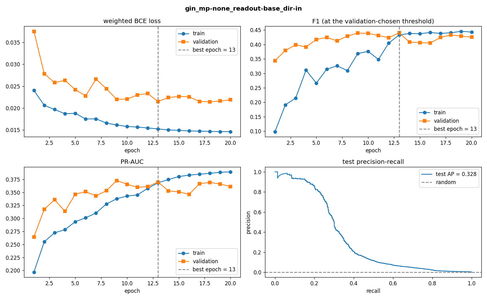

#### 7.1.2 GIN-2 · base / base — edge features inside message passing

Best epoch 15 · threshold 0.486 · params 108,419 · `Outputs/GIN/gin_mp-base_readout-base_dir-in/`

| Split | F1 | Precision | Recall | PR-AUC | ROC-AUC | Precision@5 % | Recall@5 % |
|---|---|---|---|---|---|---|---|
| train | 0.548 | 0.650 | 0.474 | 0.519 | 0.989 | 0.0136 | 0.905 |
| val | 0.554 | 0.846 | 0.411 | 0.472 | 0.970 | 0.0167 | 0.783 |
| test | **0.456** | 0.659 | 0.348 | 0.392 | 0.961 | 0.0174 | 0.771 |

- +0.085 F1 over GIN-1 from the same 20 features entering the convolutions (RQ1); precision
  0.48 → 0.66, recall +0.05.

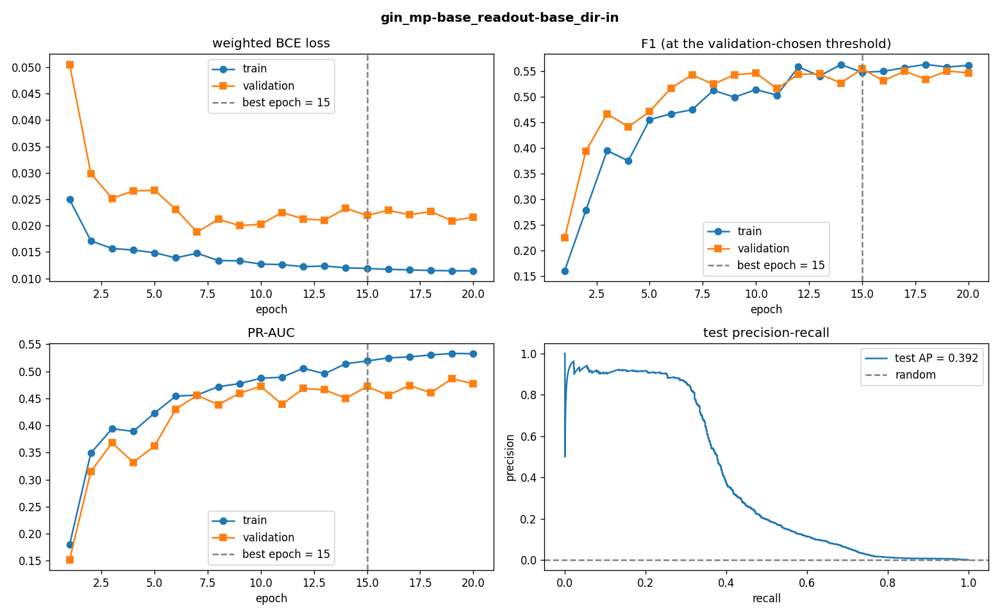

#### 7.1.3 GIN-3 · none / base+GFP — GFP only at the decision layer

Best epoch 11 · threshold 0.561 · params 110,851 · `Outputs/GIN/gin_mp-none_readout-full_dir-in/`

| Split | F1 | Precision | Recall | PR-AUC | ROC-AUC | Precision@5 % | Recall@5 % |
|---|---|---|---|---|---|---|---|
| train | 0.453 | 0.565 | 0.377 | 0.410 | 0.984 | 0.0132 | 0.875 |
| val | 0.548 | 0.813 | 0.413 | 0.487 | 0.981 | 0.0184 | 0.861 |
| test | **0.471** | 0.635 | 0.375 | 0.435 | 0.980 | 0.0194 | 0.861 |

- +0.100 F1 over GIN-1 from the 61 GFP features at the readout alone (RQ2) — more than base
  features in message passing gave (GIN-2).

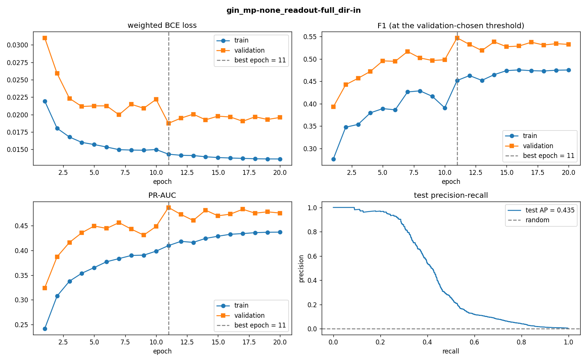

#### 7.1.4 GIN-4 · base+GFP / base+GFP — GFP everywhere

Best epoch 10 · threshold 0.568 · params 131,843 · `Outputs/GIN/gin_mp-full_readout-full_dir-in/`

| Split | F1 | Precision | Recall | PR-AUC | ROC-AUC | Precision@5 % | Recall@5 % |
|---|---|---|---|---|---|---|---|
| train | 0.563 | 0.692 | 0.475 | 0.546 | 0.991 | 0.0140 | 0.928 |
| val | 0.598 | 0.831 | 0.467 | 0.538 | 0.979 | 0.0178 | 0.837 |
| test | **0.512** | 0.743 | 0.390 | 0.479 | 0.974 | 0.0186 | 0.827 |

- Second best; the highest test precision of the family (0.743) at lower recall. The one clear
  overfitter: validation loss rises from epoch 10 while train PR-AUC climbs to 0.62 (val 0.49)
  by epoch 20; the checkpoint at epoch 10 was taken before the damage.

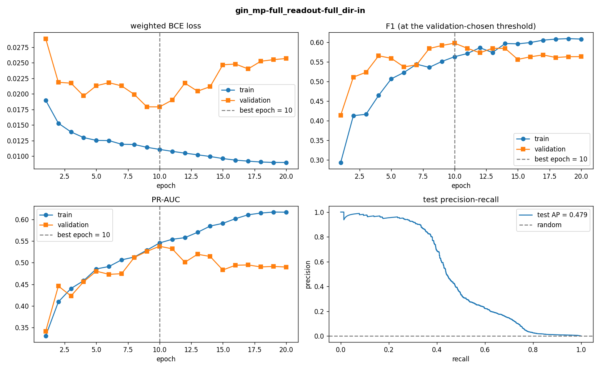

#### 7.1.5 GIN-5 · base / base+GFP — GFP at the decision layer only

Best epoch 8 · threshold 0.504 · params 116,227 · `Outputs/GIN/gin_mp-base_readout-full_dir-in/`

| Split | F1 | Precision | Recall | PR-AUC | ROC-AUC | Precision@5 % | Recall@5 % |
|---|---|---|---|---|---|---|---|
| train | 0.534 | 0.666 | 0.445 | 0.482 | 0.986 | 0.0134 | 0.886 |
| val | 0.609 | 0.820 | 0.484 | 0.549 | 0.983 | 0.0184 | 0.864 |
| test | **0.525** | 0.678 | 0.429 | 0.484 | 0.980 | 0.0195 | 0.867 |

- Best of the family: +0.154 over GIN-1, best recall (0.429) and best Recall@5 % (0.867);
  validation loss flat after epoch 8, no overfitting.

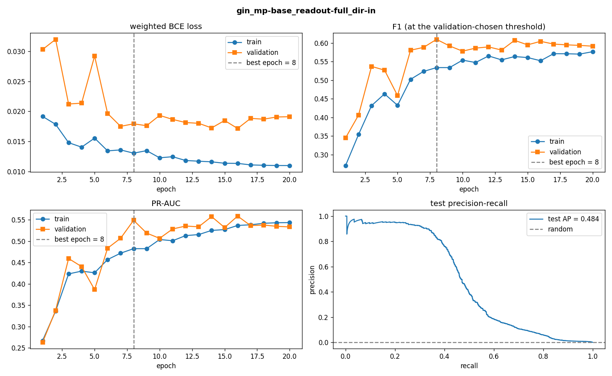

#### 7.1.6 GIN-6 · base / GFP only — are raw features redundant once message passing has used them?

Best epoch 19 · threshold 0.646 · params 113,667 · `Outputs/GIN/gin_mp-base_readout-gfp_dir-in/`

| Split | F1 | Precision | Recall | PR-AUC | ROC-AUC | Precision@5 % | Recall@5 % |
|---|---|---|---|---|---|---|---|
| train | 0.526 | 0.707 | 0.418 | 0.492 | 0.989 | 0.0137 | 0.911 |
| val | 0.533 | 0.678 | 0.439 | 0.464 | 0.971 | 0.0171 | 0.801 |
| test | **0.440** | 0.507 | 0.388 | 0.395 | 0.961 | 0.0173 | 0.770 |

- No: dropping the 20 baseline features from the readout costs 0.085 against GIN-5 and even
  0.016 against GIN-2. Still improving at epoch 19, threshold 0.65.

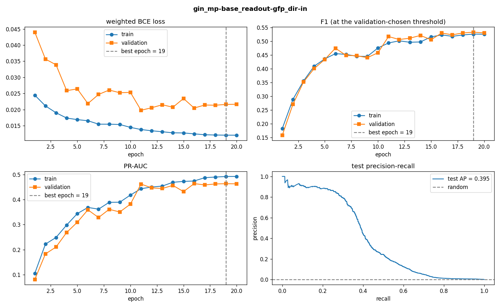

#### 7.1.7 GIN-7 · none / GFP only — GFP alone vs baseline alone

Best epoch 20 · threshold 0.685 · params 108,291 · `Outputs/GIN/gin_mp-none_readout-gfp_dir-in/`

| Split | F1 | Precision | Recall | PR-AUC | ROC-AUC | Precision@5 % | Recall@5 % |
|---|---|---|---|---|---|---|---|
| train | 0.273 | 0.686 | 0.170 | 0.247 | 0.965 | 0.0118 | 0.780 |
| val | 0.319 | 0.458 | 0.245 | 0.239 | 0.955 | 0.0164 | 0.771 |
| test | **0.256** | 0.265 | 0.248 | 0.198 | 0.941 | 0.0164 | 0.731 |

- Worst of the family: the 61 GFP features alone at the readout (0.256) are far below the 20
  baseline features alone (GIN-1, 0.371). GFP complements the baseline features, it does not
  replace them. Still improving at epoch 20, threshold 0.69.

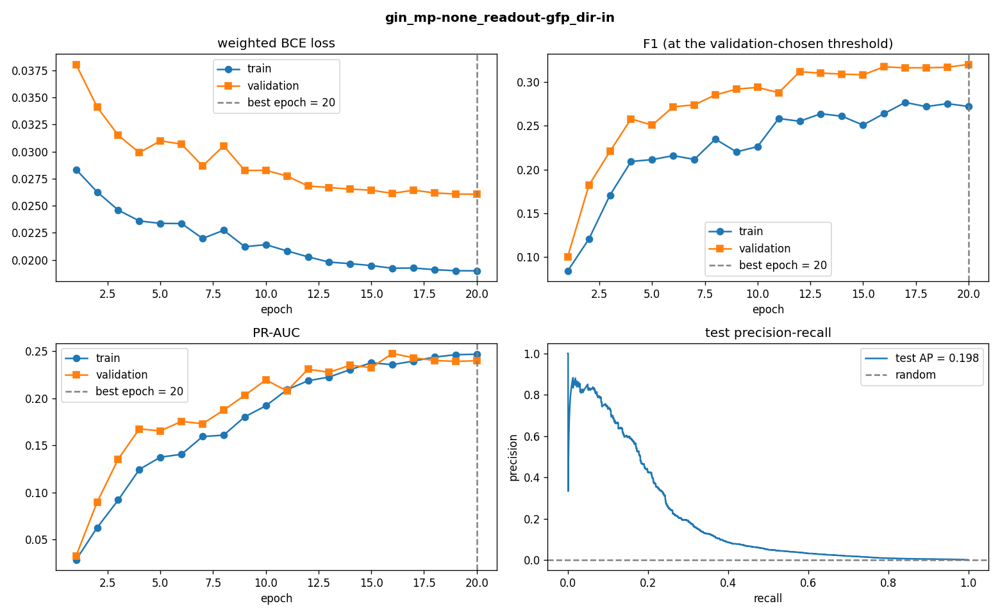

#### 7.1.8 Best of the GIN family

Ranked by **validation F1** — the metric every choice is made on (bold = the family's best;
gaps under 0.02 are ties). Test is shown, never used to choose. Precision, recall, PR-AUC,
Precision@5 % and Recall@5 % are **test** values at the validation threshold. Precision@5 % is
bounded by prevalence / 0.05 — 0.015 on train, 0.021 on val, 0.023 on test: a 5 % alert budget
is ~45× the laundering share, so every run sits near the ceiling and the column cannot separate
models; Recall@5 % is the informative operating-point number.

| Run | mp / readout | best ep | F1 train | F1 val | F1 test | Precision | Recall | PR-AUC | Precision@5 % | Recall@5 % |
|---|---|---|---|---|---|---|---|---|---|---|
| GIN-5 | base / base+GFP | 8 | 0.534 | **0.609** | 0.525 | 0.678 | 0.429 | 0.484 | 0.0195 | 0.867 |
| GIN-4 | base+GFP / base+GFP | 10 | 0.563 | 0.598 | 0.512 | 0.743 | 0.390 | 0.479 | 0.0186 | 0.827 |
| GIN-2 | base / base | 15 | 0.548 | 0.554 | 0.456 | 0.659 | 0.348 | 0.392 | 0.0174 | 0.771 |
| GIN-3 | none / base+GFP | 11 | 0.453 | 0.548 | 0.471 | 0.635 | 0.375 | 0.435 | 0.0194 | 0.861 |
| GIN-6 | base / GFP only | 19 | 0.526 | 0.533 | 0.440 | 0.507 | 0.388 | 0.395 | 0.0173 | 0.770 |
| GIN-1 | none / base | 13 | 0.432 | 0.439 | 0.371 | 0.481 | 0.302 | 0.328 | 0.0183 | 0.814 |
| GIN-7 | none / GFP only | 20 | 0.273 | 0.319 | 0.256 | 0.265 | 0.248 | 0.198 | 0.0164 | 0.731 |

**Best of the family: GIN-5** by validation F1 (0.609; GIN-4 at 0.598 is inside the tie band
but overfits) — baseline features in message passing, all 81 features at the readout: test F1
0.525 (+0.154 over GIN-1), best recall and Recall@5 %, no overfitting (curves in §7.1.5).

- **RQ1:** edge features inside message passing help — +0.085 F1 (GIN-1 → GIN-2).
- **RQ2:** GFP features help further and their value sits at the decision layer — +0.100 from
  GFP at the readout alone (GIN-1 → GIN-3); pushing GFP into message passing as well (GIN-4) is
  a tie with GIN-5 and overfits. GFP complements the baseline features, it does not replace
  them (GIN-6, GIN-7).
- Single seed: differences below ~0.02 F1 are ties (the 23 Sep batch of the same configs
  landed within ±0.02).

### 7.2 GATv2 family (hidden 128, dir=in, seed 42)

`invariant_params` = **67,585** in every run; training logs in the executed `GAT_fixed_architecture.ipynb`.

#### 7.2.1 GAT-1 · none / base — topology alone, the reference point

Best epoch 20 · threshold 0.355 · params 103,041 · `Outputs/GAT/gat_mp-none_readout-base_dir-in/`

| Split | F1 | Precision | Recall | PR-AUC | ROC-AUC | Precision@5 % | Recall@5 % |
|---|---|---|---|---|---|---|---|
| train | 0.341 | 0.353 | 0.330 | 0.303 | 0.974 | 0.0123 | 0.818 |
| val | 0.434 | 0.604 | 0.339 | 0.354 | 0.974 | 0.0180 | 0.845 |
| test | **0.392** | 0.513 | 0.317 | 0.330 | 0.973 | 0.0189 | 0.841 |

- No edge features in message passing; the classifier sees the 20 baseline features. The GATv2
  anchor; 0.021 above GIN-1 (0.371), borderline for a single seed. Still improving at epoch 20.

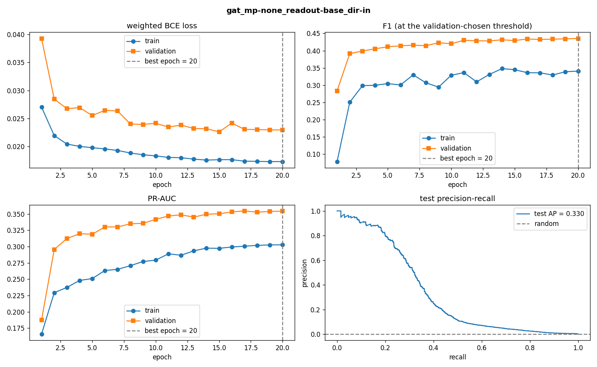

#### 7.2.2 GAT-2 · base / base — edge features inside message passing

Best epoch 13 · threshold 0.477 · params 108,161 · `Outputs/GAT/gat_mp-base_readout-base_dir-in/`

| Split | F1 | Precision | Recall | PR-AUC | ROC-AUC | Precision@5 % | Recall@5 % |
|---|---|---|---|---|---|---|---|
| train | 0.388 | 0.427 | 0.356 | 0.361 | 0.978 | 0.0127 | 0.842 |
| val | 0.498 | 0.726 | 0.379 | 0.439 | 0.978 | 0.0183 | 0.857 |
| test | **0.435** | 0.590 | 0.345 | 0.389 | 0.975 | 0.0189 | 0.841 |

- +0.043 F1 over GAT-1 from the same 20 features entering the attention (RQ1) — half the
  GIN gain (+0.085); precision 0.51 → 0.59.

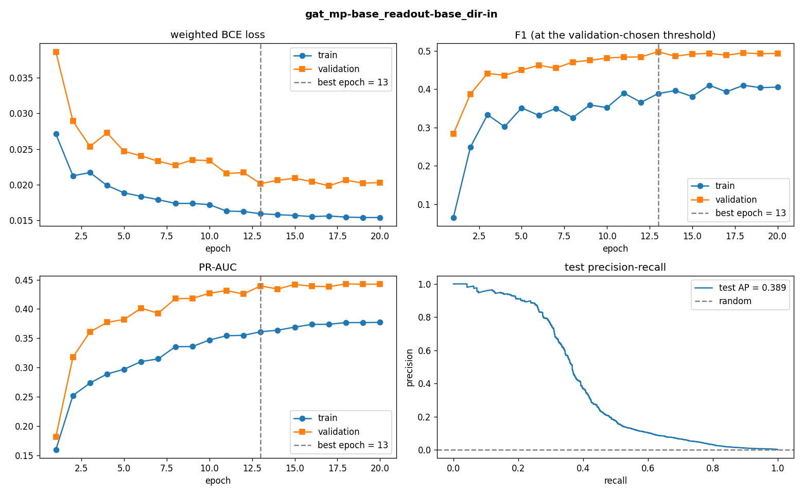

#### 7.2.3 GAT-3 · none / base+GFP — GFP only at the decision layer

Best epoch 20 · threshold 0.480 · params 110,849 · `Outputs/GAT/gat_mp-none_readout-full_dir-in/`

| Split | F1 | Precision | Recall | PR-AUC | ROC-AUC | Precision@5 % | Recall@5 % |
|---|---|---|---|---|---|---|---|
| train | 0.452 | 0.555 | 0.381 | 0.394 | 0.983 | 0.0131 | 0.871 |
| val | 0.524 | 0.689 | 0.423 | 0.454 | 0.980 | 0.0182 | 0.855 |
| test | **0.469** | 0.615 | 0.379 | 0.419 | 0.979 | 0.0192 | 0.853 |

- +0.077 F1 over GAT-1 from the 61 GFP features at the readout alone (RQ2) — again more than
  base features in message passing gave (GAT-2); a tie with GIN-3 (0.471).

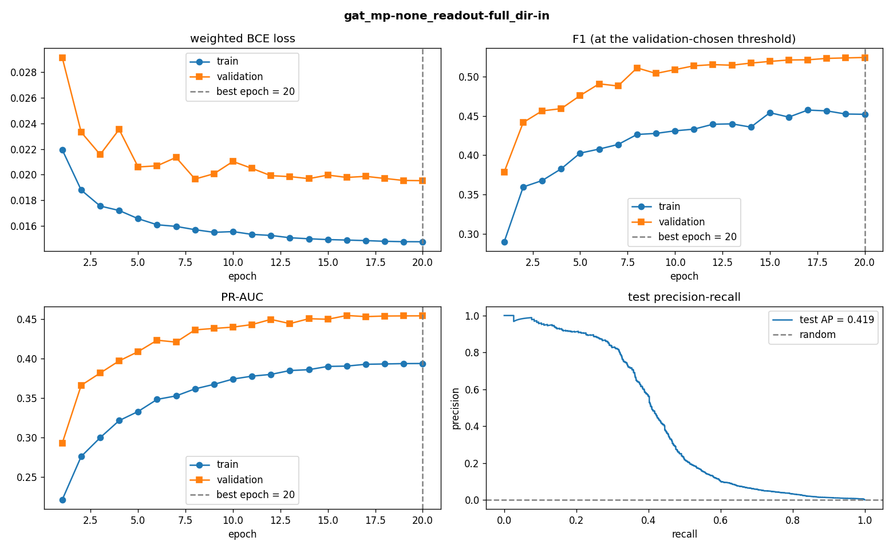

#### 7.2.4 GAT-4 · base+GFP / base+GFP — GFP everywhere

Best epoch 19 · threshold 0.513 · params 131,585 · `Outputs/GAT/gat_mp-full_readout-full_dir-in/`

| Split | F1 | Precision | Recall | PR-AUC | ROC-AUC | Precision@5 % | Recall@5 % |
|---|---|---|---|---|---|---|---|
| train | 0.507 | 0.597 | 0.441 | 0.477 | 0.988 | 0.0137 | 0.906 |
| val | 0.570 | 0.765 | 0.454 | 0.512 | 0.981 | 0.0182 | 0.856 |
| test | **0.488** | 0.611 | 0.406 | 0.458 | 0.978 | 0.0189 | 0.841 |

- A tie with GAT-5 (−0.012). Unlike GIN-4 it does not overfit: validation loss flat after
  epoch 9, train PR-AUC (0.477) below validation (0.512). The slowest run, ~150 s per epoch.

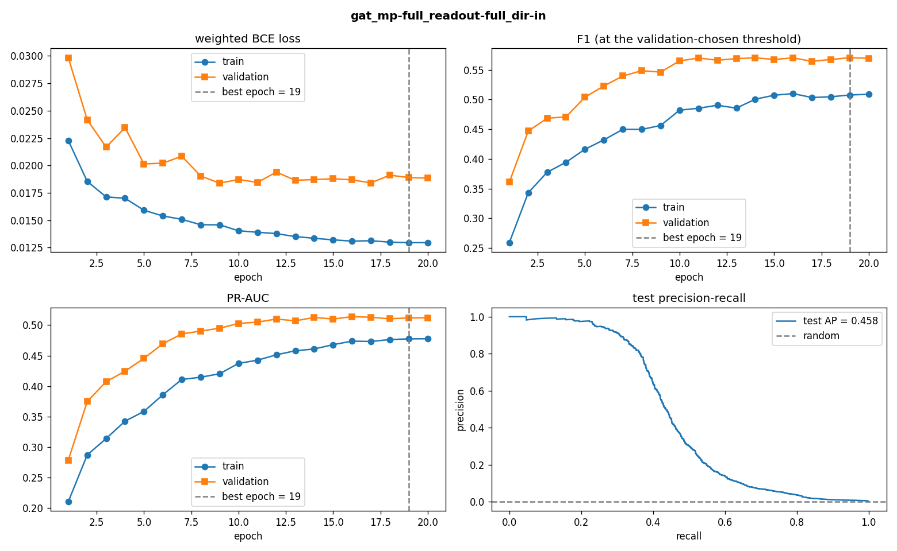

#### 7.2.5 GAT-5 · base / base+GFP — GFP at the decision layer only

Best epoch 20 · threshold 0.603 · params 115,969 · `Outputs/GAT/gat_mp-base_readout-full_dir-in/`

| Split | F1 | Precision | Recall | PR-AUC | ROC-AUC | Precision@5 % | Recall@5 % |
|---|---|---|---|---|---|---|---|
| train | 0.475 | 0.679 | 0.365 | 0.424 | 0.985 | 0.0132 | 0.878 |
| val | 0.550 | 0.814 | 0.416 | 0.498 | 0.982 | 0.0185 | 0.866 |
| test | **0.500** | 0.720 | 0.383 | 0.451 | 0.980 | 0.0192 | 0.851 |

- Best of the family: +0.108 over GAT-1 and the highest test precision (0.720); validation
  loss flat, no overfitting, still improving at epoch 20.

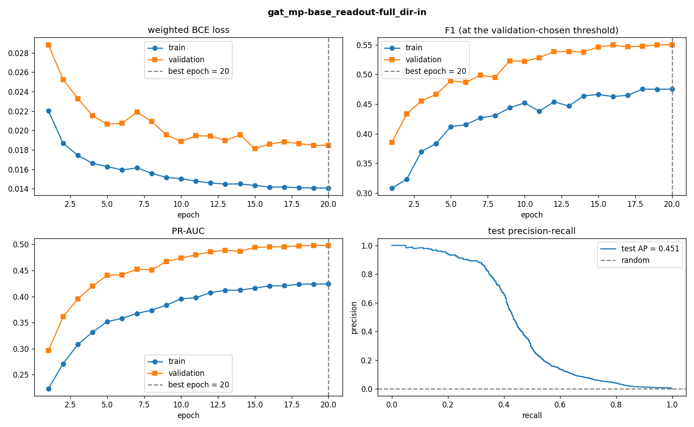

#### 7.2.6 GAT-6 · base / GFP only — are raw features redundant once message passing has used them?

Best epoch 17 · threshold 0.698 · params 113,409 · `Outputs/GAT/gat_mp-base_readout-gfp_dir-in/`

| Split | F1 | Precision | Recall | PR-AUC | ROC-AUC | Precision@5 % | Recall@5 % |
|---|---|---|---|---|---|---|---|
| train | 0.379 | 0.603 | 0.277 | 0.311 | 0.975 | 0.0125 | 0.828 |
| val | 0.441 | 0.555 | 0.366 | 0.336 | 0.965 | 0.0169 | 0.795 |
| test | **0.379** | 0.411 | 0.351 | 0.312 | 0.960 | 0.0177 | 0.787 |

- No: dropping the 20 baseline features from the readout costs 0.121 against GAT-5 and 0.056
  against GAT-2 — the same pattern as GIN-6, but larger.

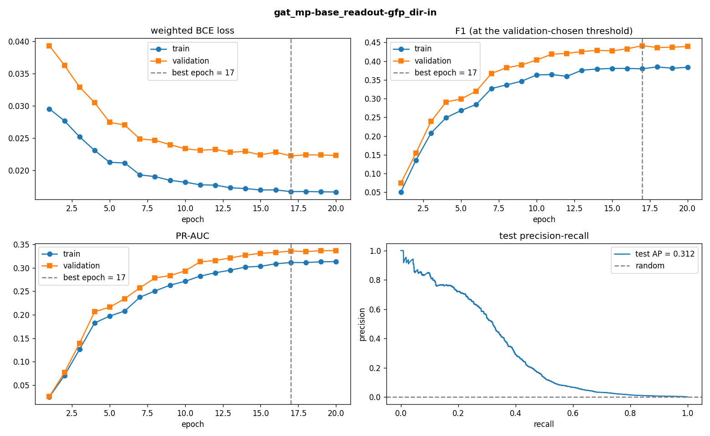

#### 7.2.7 GAT-7 · none / GFP only — GFP alone vs baseline alone

Best epoch 20 · threshold 0.385 · params 108,289 · `Outputs/GAT/gat_mp-none_readout-gfp_dir-in/`

| Split | F1 | Precision | Recall | PR-AUC | ROC-AUC | Precision@5 % | Recall@5 % |
|---|---|---|---|---|---|---|---|
| train | 0.218 | 0.328 | 0.163 | 0.138 | 0.936 | 0.0099 | 0.658 |
| val | 0.240 | 0.268 | 0.217 | 0.160 | 0.929 | 0.0143 | 0.673 |
| test | **0.184** | 0.154 | 0.228 | 0.112 | 0.919 | 0.0143 | 0.637 |

- Worst of the family: the 61 GFP features alone at the readout (0.184) are far below the 20
  baseline features alone (GAT-1, 0.392); test ROC-AUC 0.919, the only run below 0.94. Still
  improving at epoch 20.

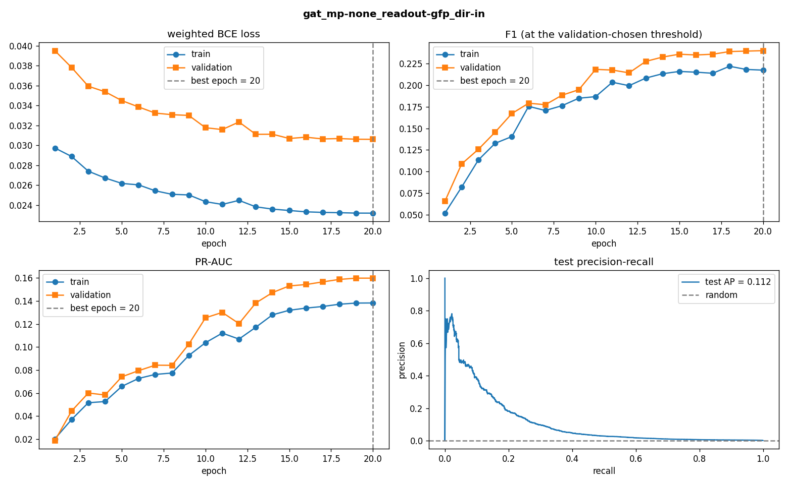

#### 7.2.8 Best of the GATv2 family

Ranked by validation F1 (bold = the family's best, ties within 0.02); columns as in §7.1.8
(test values at the validation threshold, never used to choose).

| Run | mp / readout | best ep | F1 train | F1 val | F1 test | Precision | Recall | PR-AUC | Precision@5 % | Recall@5 % |
|---|---|---|---|---|---|---|---|---|---|---|
| GAT-4 | base+GFP / base+GFP | 19 | 0.507 | **0.570** | 0.488 | 0.611 | 0.406 | 0.458 | 0.0189 | 0.841 |
| GAT-5 | base / base+GFP | 20 | 0.475 | **0.550** | 0.500 | 0.720 | 0.383 | 0.451 | 0.0192 | 0.851 |
| GAT-3 | none / base+GFP | 20 | 0.452 | 0.524 | 0.469 | 0.615 | 0.379 | 0.419 | 0.0192 | 0.853 |
| GAT-2 | base / base | 13 | 0.388 | 0.498 | 0.435 | 0.590 | 0.345 | 0.389 | 0.0189 | 0.841 |
| GAT-6 | base / GFP only | 17 | 0.379 | 0.441 | 0.379 | 0.411 | 0.351 | 0.312 | 0.0177 | 0.787 |
| GAT-1 | none / base | 20 | 0.341 | 0.434 | 0.392 | 0.513 | 0.317 | 0.330 | 0.0189 | 0.841 |
| GAT-7 | none / GFP only | 20 | 0.218 | 0.240 | 0.184 | 0.154 | 0.228 | 0.112 | 0.0143 | 0.637 |

**Best of the family: GAT-4 ≈ GAT-5, a tie** by validation F1 (0.570 vs 0.550, inside the 0.02
band; on test GAT-5 0.500 vs GAT-4 0.488, also a tie). Both put the baseline features into the
attention and all 81 features at the readout — the configuration that won for GIN; GAT-4 also
feeds GFP into the attention. GAT-5 has the highest test precision; neither overfits (curves in
§7.2.4, §7.2.5).

- **RQ1:** edge features inside the attention help, but half as much as for GIN — +0.043 F1
  (GAT-1 → GAT-2).
- **RQ2:** GFP at the decision layer is again the larger lever — +0.077 from GFP at the readout
  alone (GAT-1 → GAT-3); GFP everywhere (GAT-4) is a tie with GAT-5. GFP complements the
  baseline features, it does not replace them (GAT-6, GAT-7).
- **No overfitting in any run:** validation loss flat to epoch 20 and train PR-AUC below
  validation throughout; five runs saved their checkpoint at epoch 19–20, i.e. were still
  improving when the fixed 20-epoch budget ended.
- Single seed: differences below ~0.02 F1 are ties.

**GATv2 vs GIN, same configuration** (test F1; the two families differ only in the aggregation
rule):

| Config | mp / readout | GIN | GATv2 | GATv2 − GIN |
|---|---|---|---|---|
| 1 | none / base | 0.371 | 0.392 | +0.021 |
| 2 | base / base | 0.456 | 0.435 | −0.021 |
| 3 | none / base+GFP | 0.471 | 0.469 | −0.002 |
| 4 | base+GFP / base+GFP | 0.512 | 0.488 | −0.024 |
| 5 | base / base+GFP | **0.525** | **0.500** | −0.025 |
| 6 | base / GFP only | 0.440 | 0.379 | −0.061 |
| 7 | none / GFP only | 0.256 | 0.184 | −0.072 |

- Attention does not beat the plain sum: configs 1–5 are ties or small gaps (±0.025), and GATv2
  falls clearly behind only when the readout loses the baseline features (6, 7).
- The ranking is almost the same for both operators — configs 5, 4, 3, 2 on top in that order,
  GFP only at the readout last; only 1 and 6 swap — so the feature findings (RQ1, RQ2) do not
  depend on the aggregation rule.

### 7.3 PNA family (hidden 128, dir=in, seed 42)

`invariant_params` = **427,265** in every run; training logs in the executed `PNA_fixed_architecture.ipynb`.

#### 7.3.1 PNA-1 · none / base — topology alone, the reference point

Best epoch 12 · threshold 0.490 · params 561,537 · `Outputs/PNA/pna_mp-none_readout-base_dir-in/`

| Split | F1 | Precision | Recall | PR-AUC | ROC-AUC | Precision@5 % | Recall@5 % |
|---|---|---|---|---|---|---|---|
| train | 0.467 | 0.622 | 0.374 | 0.404 | 0.977 | 0.0129 | 0.852 |
| val | 0.491 | 0.761 | 0.362 | 0.405 | 0.975 | 0.0180 | 0.847 |
| test | **0.452** | 0.600 | 0.363 | 0.389 | 0.976 | 0.0193 | 0.856 |

- No edge features in message passing; the classifier sees the 20 baseline features. The PNA
  anchor, already above GIN-1 (0.371) and GAT-1 (0.392).

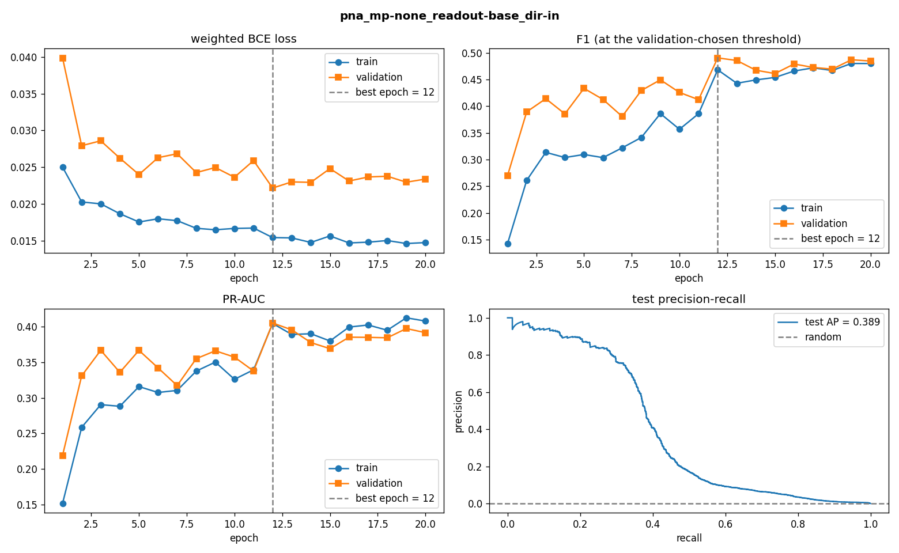

#### 7.3.2 PNA-2 · base / base — edge features inside message passing

Best epoch 14 · threshold 0.632 · params 599,681 · `Outputs/PNA/pna_mp-base_readout-base_dir-in/`

| Split | F1 | Precision | Recall | PR-AUC | ROC-AUC | Precision@5 % | Recall@5 % |
|---|---|---|---|---|---|---|---|
| train | 0.585 | 0.779 | 0.468 | 0.547 | 0.989 | 0.0137 | 0.907 |
| val | 0.651 | 0.844 | 0.530 | 0.605 | 0.985 | 0.0186 | 0.872 |
| test | **0.614** | 0.776 | 0.507 | 0.578 | 0.985 | 0.0198 | 0.881 |

- +0.162 F1 over PNA-1 from the same 20 features entering message passing (RQ1) — the largest
  RQ1 gain of the three operators (GIN +0.085, GATv2 +0.043); best test PR-AUC of the family.

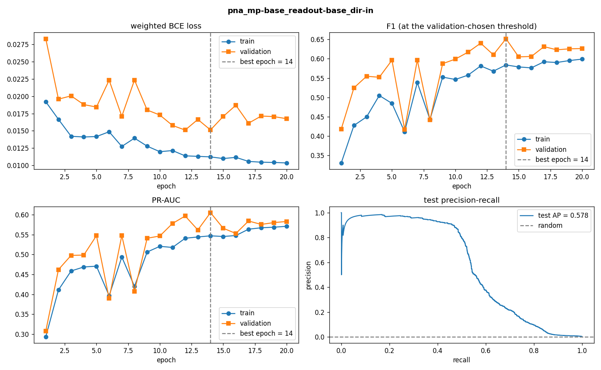

#### 7.3.3 PNA-3 · none / base+GFP — GFP only at the decision layer

Best epoch 14 · threshold 0.453 · params 569,345 · `Outputs/PNA/pna_mp-none_readout-full_dir-in/`

| Split | F1 | Precision | Recall | PR-AUC | ROC-AUC | Precision@5 % | Recall@5 % |
|---|---|---|---|---|---|---|---|
| train | 0.495 | 0.638 | 0.404 | 0.444 | 0.986 | 0.0134 | 0.886 |
| val | 0.574 | 0.821 | 0.441 | 0.508 | 0.982 | 0.0184 | 0.864 |
| test | **0.512** | 0.680 | 0.410 | 0.472 | 0.981 | 0.0195 | 0.865 |

- +0.060 F1 over PNA-1 from the 61 GFP features at the readout alone (RQ2) — for PNA, unlike
  GIN and GATv2, less than base features in message passing gave (PNA-2).

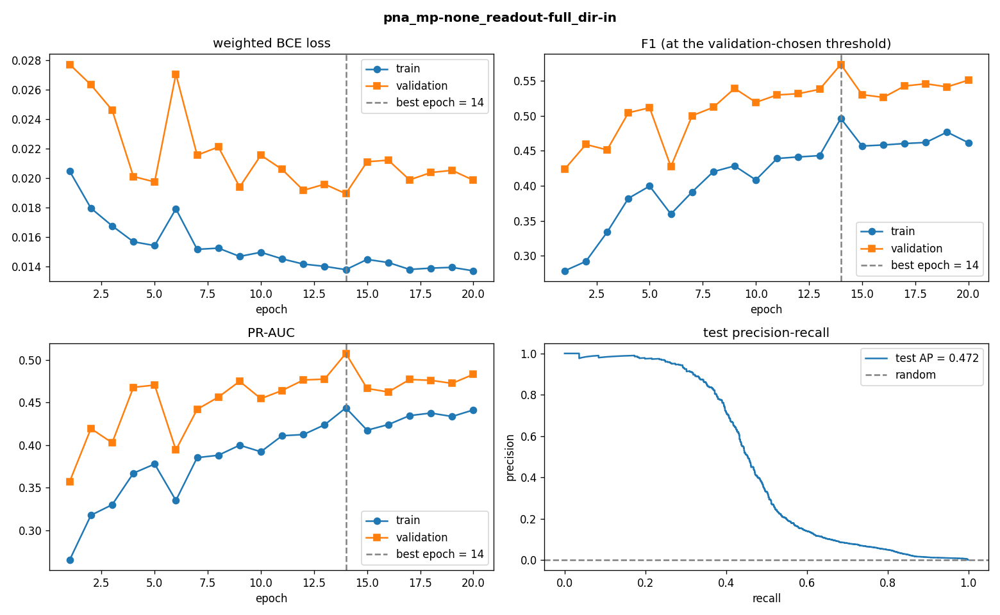

#### 7.3.4 PNA-4 · base+GFP / base+GFP — GFP everywhere

Best epoch 15 · threshold 0.699 · params 623,105 · `Outputs/PNA/pna_mp-full_readout-full_dir-in/`

| Split | F1 | Precision | Recall | PR-AUC | ROC-AUC | Precision@5 % | Recall@5 % |
|---|---|---|---|---|---|---|---|
| train | 0.598 | 0.839 | 0.464 | 0.585 | 0.993 | 0.0144 | 0.956 |
| val | 0.648 | 0.894 | 0.508 | 0.606 | 0.985 | 0.0185 | 0.870 |
| test | **0.617** | 0.856 | 0.482 | 0.575 | 0.984 | 0.0200 | 0.888 |

- Highest test F1 and precision of the family, but a tie with PNA-2 and PNA-5 (within 0.006).
- The only run with mild overfitting: validation loss rises from 0.015 at epoch 15 to 0.019 at
  epoch 20 while train PR-AUC climbs to 0.62 (val 0.58); the checkpoint at epoch 15 was taken
  before. Slowest run, ~230 s per epoch.

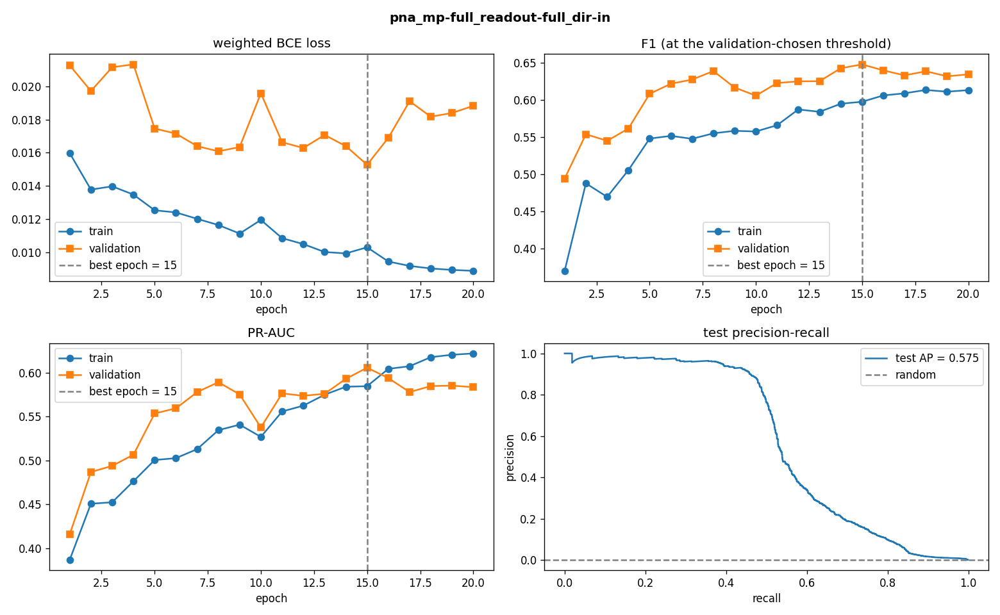

#### 7.3.5 PNA-5 · base / base+GFP — GFP at the decision layer only

Best epoch 15 · threshold 0.711 · params 607,489 · `Outputs/PNA/pna_mp-base_readout-full_dir-in/`

| Split | F1 | Precision | Recall | PR-AUC | ROC-AUC | Precision@5 % | Recall@5 % |
|---|---|---|---|---|---|---|---|
| train | 0.587 | 0.819 | 0.458 | 0.560 | 0.991 | 0.0140 | 0.927 |
| val | 0.648 | 0.872 | 0.516 | 0.610 | 0.986 | 0.0188 | 0.883 |
| test | **0.611** | 0.800 | 0.494 | 0.574 | 0.986 | 0.0201 | 0.892 |

- The configuration that won for GIN and GATv2; here a tie with PNA-2 (−0.003): GFP at the
  readout adds nothing once baseline features are in message passing. Best Recall@5 % (0.892).

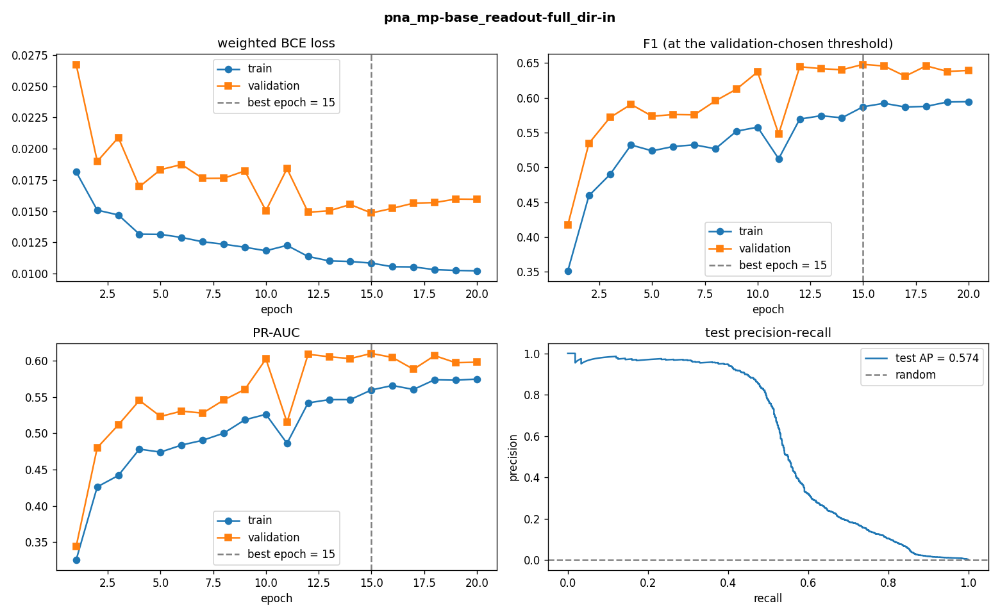

#### 7.3.6 PNA-6 · base / GFP only — are raw features redundant once message passing has used them?

Best epoch 16 · threshold 0.764 · params 604,929 · `Outputs/PNA/pna_mp-base_readout-gfp_dir-in/`

| Split | F1 | Precision | Recall | PR-AUC | ROC-AUC | Precision@5 % | Recall@5 % |
|---|---|---|---|---|---|---|---|
| train | 0.564 | 0.845 | 0.424 | 0.554 | 0.991 | 0.0140 | 0.929 |
| val | 0.621 | 0.834 | 0.495 | 0.582 | 0.982 | 0.0183 | 0.858 |
| test | **0.575** | 0.751 | 0.466 | 0.540 | 0.982 | 0.0195 | 0.868 |

- No: dropping the 20 baseline features from the readout costs 0.036 against PNA-5 and 0.039
  against PNA-2 — the same pattern as GIN-6 and GAT-6, but smaller.

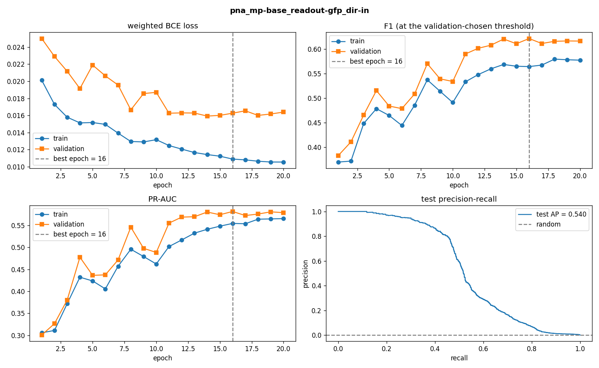

#### 7.3.7 PNA-7 · none / GFP only — GFP alone vs baseline alone

Best epoch 14 · threshold 0.562 · params 566,785 · `Outputs/PNA/pna_mp-none_readout-gfp_dir-in/`

| Split | F1 | Precision | Recall | PR-AUC | ROC-AUC | Precision@5 % | Recall@5 % |
|---|---|---|---|---|---|---|---|
| train | 0.340 | 0.644 | 0.231 | 0.282 | 0.969 | 0.0120 | 0.798 |
| val | 0.406 | 0.521 | 0.333 | 0.325 | 0.963 | 0.0169 | 0.794 |
| test | **0.356** | 0.353 | 0.360 | 0.290 | 0.959 | 0.0178 | 0.793 |

- Worst of the family: the 61 GFP features alone at the readout (0.356) are well below the 20
  baseline features alone (PNA-1, 0.452); test precision falls to 0.353 (validation 0.521).

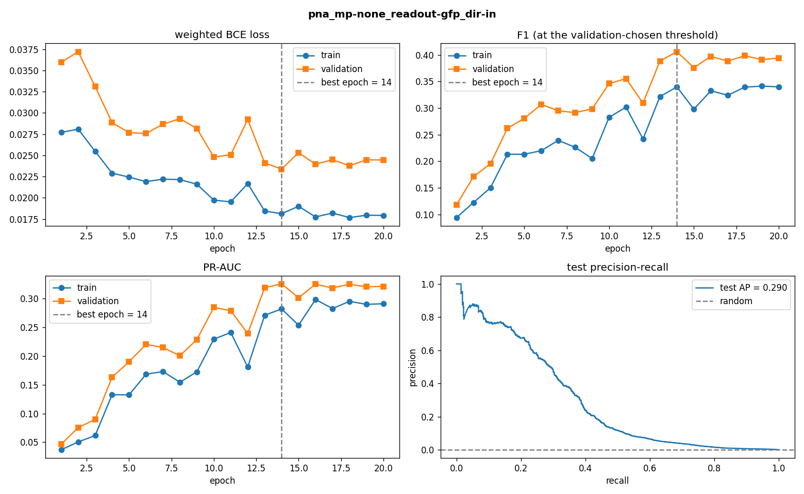

#### 7.3.8 Best of the PNA family

Ranked by validation F1 (bold = the family's best, ties within 0.02); columns as in §7.1.8
(test values at the validation threshold, never used to choose).

| Run | mp / readout | best ep | F1 train | F1 val | F1 test | Precision | Recall | PR-AUC | Precision@5 % | Recall@5 % |
|---|---|---|---|---|---|---|---|---|---|---|
| PNA-2 | base / base | 14 | 0.585 | **0.651** | 0.614 | 0.776 | 0.507 | 0.578 | 0.0198 | 0.881 |
| PNA-4 | base+GFP / base+GFP | 15 | 0.598 | **0.648** | 0.617 | 0.856 | 0.482 | 0.575 | 0.0200 | 0.888 |
| PNA-5 | base / base+GFP | 15 | 0.587 | **0.648** | 0.611 | 0.800 | 0.494 | 0.574 | 0.0201 | 0.892 |
| PNA-6 | base / GFP only | 16 | 0.564 | 0.621 | 0.575 | 0.751 | 0.466 | 0.540 | 0.0195 | 0.868 |
| PNA-3 | none / base+GFP | 14 | 0.495 | 0.574 | 0.512 | 0.680 | 0.410 | 0.472 | 0.0195 | 0.865 |
| PNA-1 | none / base | 12 | 0.467 | 0.491 | 0.452 | 0.600 | 0.363 | 0.389 | 0.0193 | 0.856 |
| PNA-7 | none / GFP only | 14 | 0.340 | 0.406 | 0.356 | 0.353 | 0.360 | 0.290 | 0.0178 | 0.793 |

**Best of the family: PNA-2 ≈ PNA-4 ≈ PNA-5, a three-way tie** by validation F1 (0.648–0.651;
test 0.611–0.617, also a tie). PNA-2 gets there with the 20 baseline features alone, no GFP
(curves in §7.3.2, §7.3.4, §7.3.5).

- **RQ1:** edge features inside message passing are the big lever for PNA — +0.162 F1
  (PNA-1 → PNA-2), about twice the GIN gain and four times the GATv2 gain.
- **RQ2:** GFP helps when message passing has no edge features (+0.060, PNA-1 → PNA-3) but adds
  nothing once the baseline features are in message passing (PNA-2 → PNA-5 −0.003, → PNA-4
  +0.003). This suggests PNA's four aggregators recover from the baseline edge features much of
  what GFP pre-computes. GFP still complements, it does not replace (PNA-6, PNA-7).
- **Training:** checkpoints at epochs 12–16, so every run converged inside the 20-epoch budget
  (unlike GATv2); mild overfitting only in PNA-4. 49–78 min per run, 6.8 h for the batch
  (GIN 2.7 h, GATv2 3.4 h).
- Single seed: differences below ~0.02 F1 are ties.

**PNA vs GIN and GATv2, same configuration** (test F1):

| Config | mp / readout | GIN | GATv2 | PNA | PNA − GIN | PNA − GATv2 |
|---|---|---|---|---|---|---|
| 1 | none / base | 0.371 | 0.392 | 0.452 | +0.081 | +0.060 |
| 2 | base / base | 0.456 | 0.435 | 0.614 | +0.158 | +0.179 |
| 3 | none / base+GFP | 0.471 | 0.469 | 0.512 | +0.041 | +0.043 |
| 4 | base+GFP / base+GFP | 0.512 | 0.488 | **0.617** | +0.105 | +0.129 |
| 5 | base / base+GFP | **0.525** | **0.500** | 0.611 | +0.086 | +0.111 |
| 6 | base / GFP only | 0.440 | 0.379 | 0.575 | +0.135 | +0.196 |
| 7 | none / GFP only | 0.256 | 0.184 | 0.356 | +0.100 | +0.172 |

- PNA is best in all seven configurations; its best run is +0.092 over GIN-5 and +0.117 over
  GAT-5, far outside seed noise.
- **Caveat:** PNA has ~5× the parameters of GIN and GATv2 (562k–623k vs 103k–132k) at the same
  depth and width, so the gap belongs to the whole operator (four aggregators, degree scalers,
  larger MLPs), not to the aggregation rule alone. The within-family findings are unaffected.
- **The feature story depends on the operator:** for GIN and GATv2 GFP at the readout is the
  larger lever; for PNA the baseline features in message passing are, and GFP becomes redundant
  once they are there — a more expressive aggregator finds on its own part of the structure that
  GFP hand-codes.
- No sign of leakage: same data, splits and loaders as GIN and GATv2, degree histogram from the
  train graph only, test below validation as in every family.

### 7.4 Graph Transformer family (hidden 128, dir=in, seed 42)

`invariant_params` = **133,121** in every run; training logs in the executed `TRANSFORMER_fixed_architecture.ipynb`.

#### 7.4.1 TR-1 · none / base — topology alone, the reference point

Best epoch 18 · threshold 0.265 · params 168,577 · `Outputs/TRANSFORMER/transformer_mp-none_readout-base_dir-in/`

| Split | F1 | Precision | Recall | PR-AUC | ROC-AUC | Precision@5 % | Recall@5 % |
|---|---|---|---|---|---|---|---|
| train | 0.300 | 0.261 | 0.353 | 0.299 | 0.977 | 0.0124 | 0.822 |
| val | 0.427 | 0.537 | 0.354 | 0.347 | 0.974 | 0.0177 | 0.833 |
| test | **0.370** | 0.389 | 0.353 | 0.337 | 0.975 | 0.0188 | 0.835 |

- No edge features in message passing; the classifier sees the 20 baseline features. The
  Transformer anchor, a tie with GIN-1 (0.371) and GAT-1 (0.392), below PNA-1 (0.452).

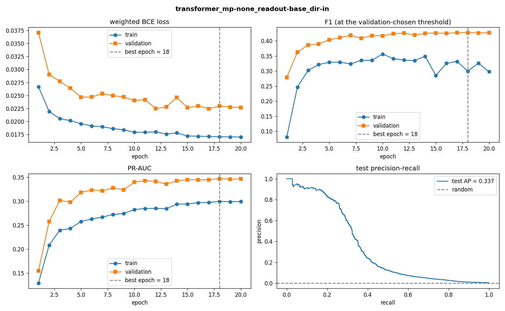

#### 7.4.2 TR-2 · base / base — edge features inside message passing

Best epoch 18 · threshold 0.578 · params 173,697 · `Outputs/TRANSFORMER/transformer_mp-base_readout-base_dir-in/`

| Split | F1 | Precision | Recall | PR-AUC | ROC-AUC | Precision@5 % | Recall@5 % |
|---|---|---|---|---|---|---|---|
| train | 0.574 | 0.731 | 0.472 | 0.549 | 0.990 | 0.0137 | 0.909 |
| val | 0.624 | 0.858 | 0.491 | 0.563 | 0.984 | 0.0185 | 0.866 |
| test | **0.586** | 0.802 | 0.461 | 0.549 | 0.984 | 0.0197 | 0.873 |

- +0.216 F1 over TR-1 from the same 20 features entering message passing (RQ1) — the largest
  RQ1 gain of the four operators (PNA +0.162, GIN +0.085, GATv2 +0.043); precision 0.39 → 0.80.

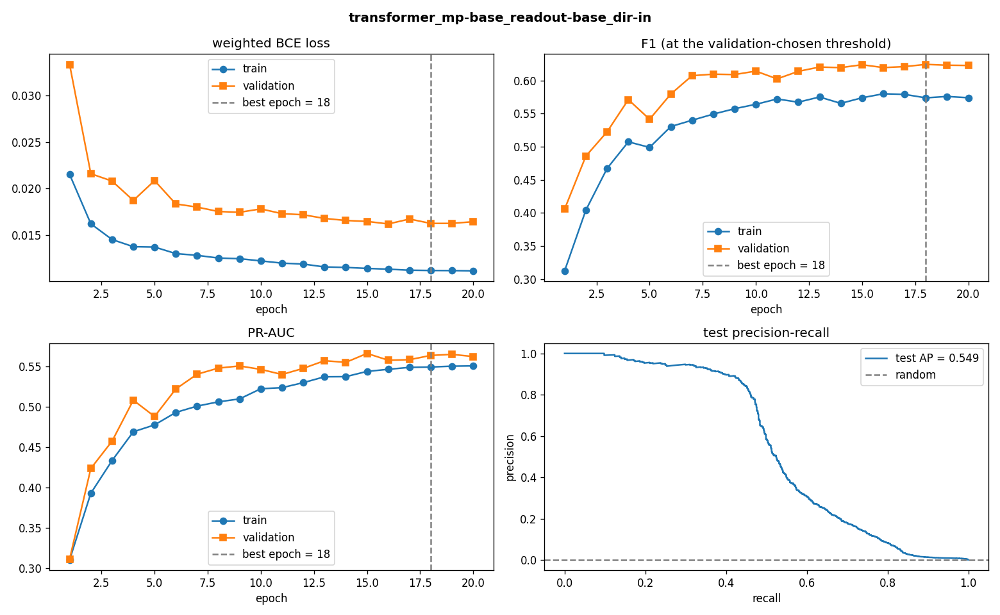

#### 7.4.3 TR-3 · none / base+GFP — GFP only at the decision layer

Best epoch 20 · threshold 0.454 · params 176,385 · `Outputs/TRANSFORMER/transformer_mp-none_readout-full_dir-in/`

| Split | F1 | Precision | Recall | PR-AUC | ROC-AUC | Precision@5 % | Recall@5 % |
|---|---|---|---|---|---|---|---|
| train | 0.437 | 0.517 | 0.379 | 0.380 | 0.983 | 0.0132 | 0.875 |
| val | 0.511 | 0.650 | 0.421 | 0.441 | 0.980 | 0.0181 | 0.849 |
| test | **0.448** | 0.535 | 0.386 | 0.411 | 0.979 | 0.0193 | 0.856 |

- +0.078 F1 over TR-1 from the 61 GFP features at the readout alone (RQ2) — as for PNA, far
  less than base features in message passing gave (TR-2). Still improving at epoch 20.

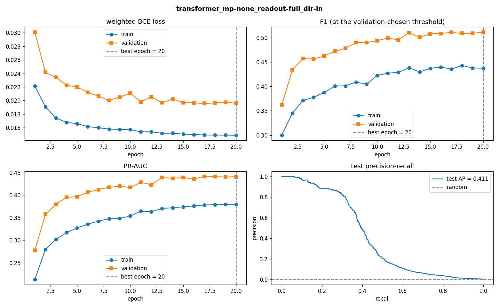

#### 7.4.4 TR-4 · base+GFP / base+GFP — GFP everywhere

Best epoch 15 · threshold 0.698 · params 197,121 · `Outputs/TRANSFORMER/transformer_mp-full_readout-full_dir-in/`

| Split | F1 | Precision | Recall | PR-AUC | ROC-AUC | Precision@5 % | Recall@5 % |
|---|---|---|---|---|---|---|---|
| train | 0.597 | 0.814 | 0.471 | 0.587 | 0.993 | 0.0144 | 0.955 |
| val | 0.644 | 0.879 | 0.508 | 0.588 | 0.981 | 0.0182 | 0.854 |
| test | **0.602** | 0.788 | 0.487 | 0.574 | 0.983 | 0.0198 | 0.881 |

- Highest test F1, recall, PR-AUC and Recall@5 % of the family, but a tie with TR-5 (−0.004)
  and TR-2 (−0.017).
- The only run with mild overfitting: validation loss is lowest at epoch 9 (0.016) and drifts up
  to 0.018 while train loss keeps falling; train PR-AUC ends above validation (0.60 vs 0.59).
  Validation F1 stays flat at 0.63–0.64, so the checkpoint at epoch 15 is unaffected. Slowest
  run, ~150 s per epoch.

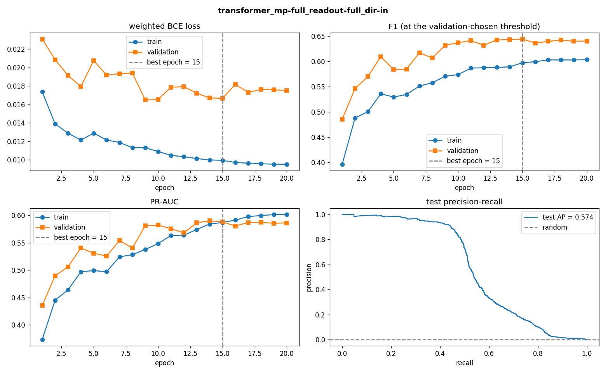

#### 7.4.5 TR-5 · base / base+GFP — GFP at the decision layer only

Best epoch 14 · threshold 0.681 · params 181,505 · `Outputs/TRANSFORMER/transformer_mp-base_readout-full_dir-in/`

| Split | F1 | Precision | Recall | PR-AUC | ROC-AUC | Precision@5 % | Recall@5 % |
|---|---|---|---|---|---|---|---|
| train | 0.569 | 0.813 | 0.438 | 0.538 | 0.990 | 0.0139 | 0.923 |
| val | 0.629 | 0.893 | 0.485 | 0.577 | 0.984 | 0.0185 | 0.867 |
| test | **0.598** | 0.832 | 0.466 | 0.553 | 0.983 | 0.0196 | 0.871 |

- The configuration that won for GIN and GATv2; here a tie with TR-2 (+0.012) and TR-4:
  GFP at the readout adds little once baseline features are in message passing. Highest test
  precision of the family (0.832); validation loss flat, no overfitting.

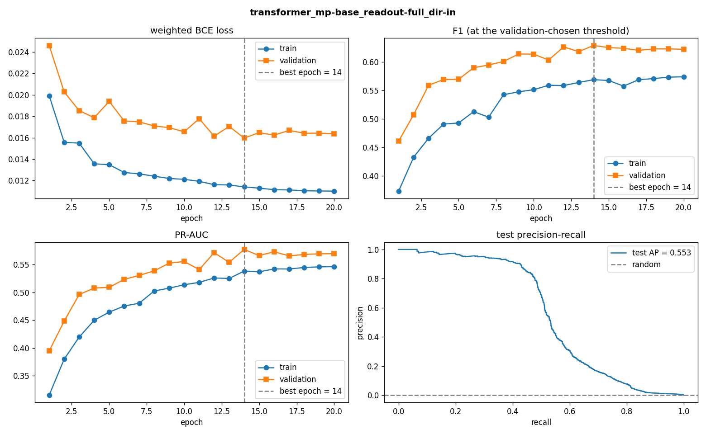

#### 7.4.6 TR-6 · base / GFP only — are raw features redundant once message passing has used them?

Best epoch 20 · threshold 0.619 · params 178,945 · `Outputs/TRANSFORMER/transformer_mp-base_readout-gfp_dir-in/`

| Split | F1 | Precision | Recall | PR-AUC | ROC-AUC | Precision@5 % | Recall@5 % |
|---|---|---|---|---|---|---|---|
| train | 0.532 | 0.721 | 0.421 | 0.500 | 0.987 | 0.0136 | 0.899 |
| val | 0.577 | 0.722 | 0.481 | 0.516 | 0.976 | 0.0176 | 0.828 |
| test | **0.534** | 0.633 | 0.462 | 0.508 | 0.976 | 0.0191 | 0.850 |

- No: dropping the 20 baseline features from the readout costs 0.063 against TR-5 and 0.051
  against TR-2 — the same pattern as the other three families.

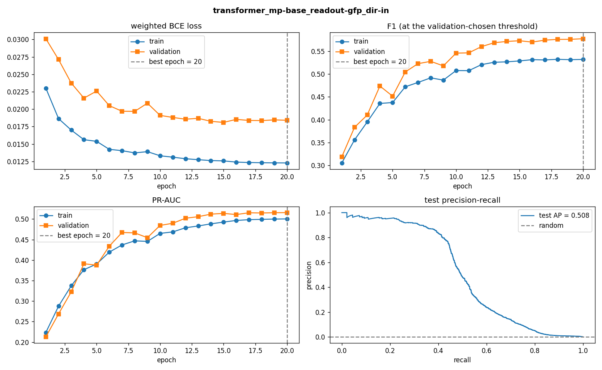

#### 7.4.7 TR-7 · none / GFP only — GFP alone vs baseline alone

Best epoch 20 · threshold 0.389 · params 173,825 · `Outputs/TRANSFORMER/transformer_mp-none_readout-gfp_dir-in/`

| Split | F1 | Precision | Recall | PR-AUC | ROC-AUC | Precision@5 % | Recall@5 % |
|---|---|---|---|---|---|---|---|
| train | 0.231 | 0.321 | 0.180 | 0.154 | 0.943 | 0.0104 | 0.688 |
| val | 0.255 | 0.284 | 0.231 | 0.178 | 0.934 | 0.0146 | 0.683 |
| test | **0.204** | 0.170 | 0.254 | 0.139 | 0.927 | 0.0148 | 0.659 |

- Worst of the family: the 61 GFP features alone at the readout (0.204) are far below the 20
  baseline features alone (TR-1, 0.370). Slow start (validation F1 0.07 after epoch 1) and still
  improving at epoch 20.

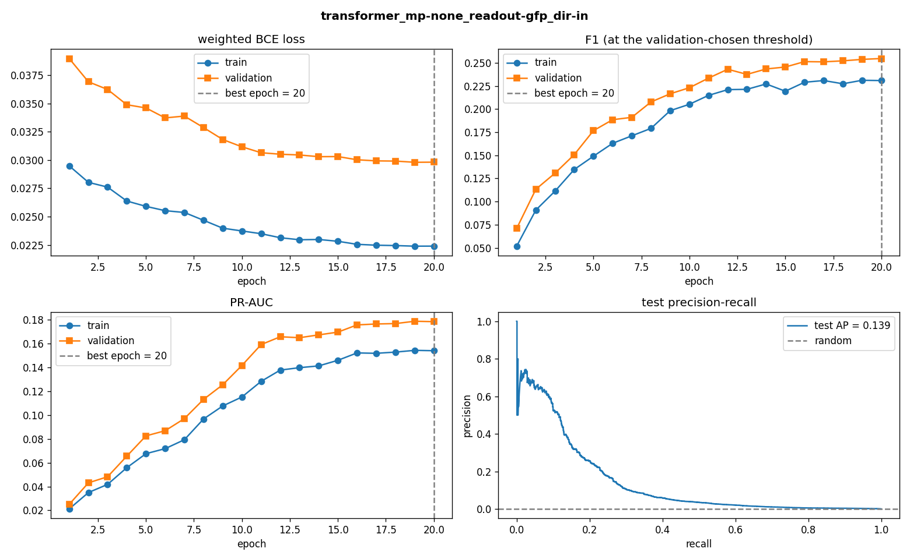

#### 7.4.8 Best of the Graph Transformer family

Ranked by validation F1 (bold = the family's best, ties within 0.02); columns as in §7.1.8
(test values at the validation threshold, never used to choose).

| Run | mp / readout | best ep | F1 train | F1 val | F1 test | Precision | Recall | PR-AUC | Precision@5 % | Recall@5 % |
|---|---|---|---|---|---|---|---|---|---|---|
| TR-4 | base+GFP / base+GFP | 15 | 0.597 | **0.644** | 0.602 | 0.788 | 0.487 | 0.574 | 0.0198 | 0.881 |
| TR-5 | base / base+GFP | 14 | 0.569 | **0.629** | 0.598 | 0.832 | 0.466 | 0.553 | 0.0196 | 0.871 |
| TR-2 | base / base | 18 | 0.574 | 0.624 | 0.586 | 0.802 | 0.461 | 0.549 | 0.0197 | 0.873 |
| TR-6 | base / GFP only | 20 | 0.532 | 0.577 | 0.534 | 0.633 | 0.462 | 0.508 | 0.0191 | 0.850 |
| TR-3 | none / base+GFP | 20 | 0.437 | 0.511 | 0.448 | 0.535 | 0.386 | 0.411 | 0.0193 | 0.856 |
| TR-1 | none / base | 18 | 0.300 | 0.427 | 0.370 | 0.389 | 0.353 | 0.337 | 0.0188 | 0.835 |
| TR-7 | none / GFP only | 20 | 0.231 | 0.255 | 0.204 | 0.170 | 0.254 | 0.139 | 0.0148 | 0.659 |

**Best of the family: TR-4 ≈ TR-5, a tie** by validation F1 (0.644 vs 0.629), with TR-2 (0.624)
exactly at the 0.02 edge; on test the three are 0.586–0.602, also ties — the same three
configurations as the PNA tie (curves in §7.4.2, §7.4.4, §7.4.5).

- **RQ1:** edge features inside message passing are the big lever — +0.216 F1 (TR-1 → TR-2),
  the largest gain of the four operators.
- **RQ2:** GFP helps when message passing has no edge features (+0.078, TR-1 → TR-3) but adds
  little once the baseline features are in message passing (TR-2 → TR-5 +0.012, → TR-4 +0.017,
  both within seed noise). GFP still complements, it does not replace (TR-6, TR-7).
- **Training:** checkpoints at epochs 14–20; three runs (TR-3, TR-6, TR-7) saved at epoch 20, i.e.
  were still improving when the fixed budget ended; mild overfitting only in TR-4. 22–49 min per
  run, 3.4 h for the batch (GIN 2.7 h, GATv2 3.4 h, PNA 6.8 h).
- Single seed: differences below ~0.02 F1 are ties.

**Graph Transformer vs the other three operators, same configuration** (test F1):

| Config | mp / readout | GIN | GATv2 | PNA | Transformer | TR − GATv2 | TR − PNA |
|---|---|---|---|---|---|---|---|
| 1 | none / base | 0.371 | 0.392 | 0.452 | 0.370 | −0.022 | −0.082 |
| 2 | base / base | 0.456 | 0.435 | 0.614 | 0.586 | +0.151 | −0.028 |
| 3 | none / base+GFP | 0.471 | 0.469 | 0.512 | 0.448 | −0.021 | −0.064 |
| 4 | base+GFP / base+GFP | 0.512 | 0.488 | **0.617** | **0.602** | +0.114 | −0.015 |
| 5 | base / base+GFP | **0.525** | **0.500** | 0.611 | 0.598 | +0.098 | −0.013 |
| 6 | base / GFP only | 0.440 | 0.379 | 0.575 | 0.534 | +0.155 | −0.041 |
| 7 | none / GFP only | 0.256 | 0.184 | 0.356 | 0.204 | +0.020 | −0.152 |

- **The Transformer's gain depends on edge features in message passing.** With them (configs 2,
  4, 5, 6) it is 0.10–0.16 above GATv2 and ties PNA on the best configurations (4, 5); without
  them (1, 3, 7) it is no better than GIN or GATv2.
- Both attention operators get the edge features, but differently: in GATv2 they only change
  the attention weights, in the Transformer they are also added to each neighbour's message
  (the value). This suggests that putting the transaction's features into the message, not
  attention itself, is what helps — PNA, which also puts them into the message, shows the same
  pattern.
- **Parameters:** the Transformer (169k–197k) is ~1.6× GIN and GATv2 but under a third of PNA
  (562k–623k), and still comes within 0.015 of PNA's best run — a tie for a single seed.
- The feature story matches PNA's: baseline features in message passing are the main lever and
  GFP at the readout becomes nearly redundant once they are there; for GIN and GATv2 it is the
  other way round.
- No sign of leakage: same data, splits and loaders as the other families, test below
  validation in every run.

### 7.5 RWPE node encoding — stage 1 (8 runs, 5 Oct)

Does the random-walk positional encoding (RWPE, §2: 16 directed return probabilities per account, non-zero for under 2 % of accounts) help when everything else is held fixed? Each run repeats one finished configuration with `NODE_ENC = rwpe16`: only `node_proj` widens to (6 + 16) → 128 (+2,048 parameters), `invariant_params` stays at the family value (GIN 67,587 · GATv2 67,585 · PNA 427,265 · Transformer 133,121, verified in every row). All eight runs come from one Kaggle session of `RWPE_fixed_architecture.ipynb` (5.9 h, T4); artifacts in `Outputs/RWPE/<FAMILY>/<run>/`. Decided on validation F1 only, gaps under 0.02 are ties; test is shown, never used to choose.

#### 7.5.1 GIN-5 + RWPE · base / base+GFP · rwpe16

Best epoch 16 · threshold 0.650 · params 118,275 · 63 s / epoch · `Outputs/RWPE/GIN/gin_mp-base_readout-full_dir-in_enc-rwpe16/`

| Split | F1 | Precision | Recall | PR-AUC | ROC-AUC | Precision@5 % | Recall@5 % |
|---|---|---|---|---|---|---|---|
| train | 0.572 | 0.786 | 0.449 | 0.535 | 0.990 | 0.0139 | 0.922 |
| val | 0.598 | 0.865 | 0.457 | 0.536 | 0.981 | 0.0181 | 0.851 |
| test | **0.486** | 0.765 | 0.356 | 0.435 | 0.972 | 0.0183 | 0.815 |

- Tie with GIN-5 on validation (0.598 vs 0.609, −0.011); on test 0.486 vs 0.525, lower on every metric except precision (0.765 vs 0.678), because the threshold moved up to 0.65 and recall fell to 0.356.
- Mild overfitting that GIN-5 did not have: validation loss is lowest at epoch 7 and drifts up to 0.019 by epoch 20 while train loss keeps falling; train PR-AUC passes validation after epoch 13 (0.541 vs 0.524 at the end).
- The same configuration run on 4 Oct with the same seed gave validation 0.600 and test 0.524: validation agrees within 0.002, test moved by 0.04 — the test spread of a single seed (§7.5.9).

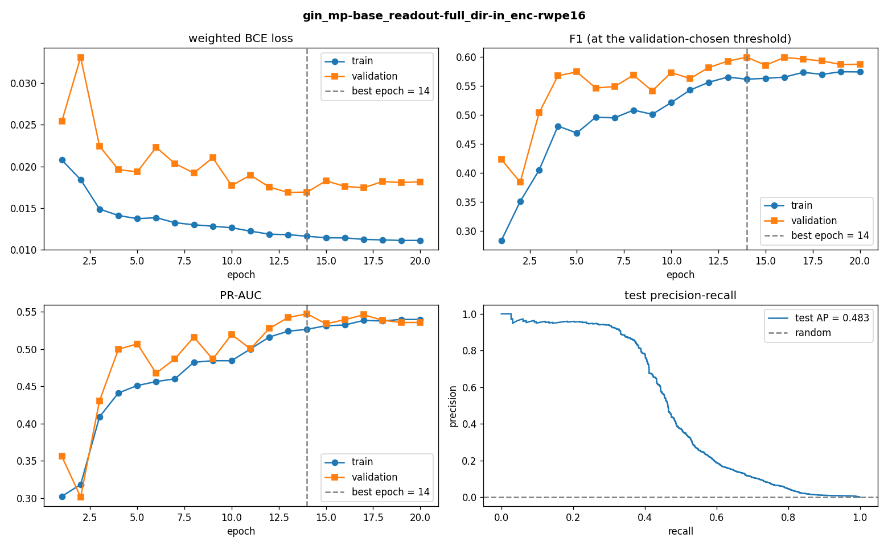

#### 7.5.2 GIN-4 + RWPE · base+GFP / base+GFP · rwpe16

Best epoch 7 · threshold 0.529 · params 133,891 · 127 s / epoch · `Outputs/RWPE/GIN/gin_mp-full_readout-full_dir-in_enc-rwpe16/`

| Split | F1 | Precision | Recall | PR-AUC | ROC-AUC | Precision@5 % | Recall@5 % |
|---|---|---|---|---|---|---|---|
| train | 0.526 | 0.598 | 0.469 | 0.515 | 0.986 | 0.0135 | 0.896 |
| val | 0.594 | 0.822 | 0.465 | 0.540 | 0.980 | 0.0182 | 0.853 |
| test | **0.519** | 0.738 | 0.401 | 0.465 | 0.974 | 0.0187 | 0.831 |

- Tie with GIN-4 on validation (0.594 vs 0.598) and on test (0.519 vs 0.512); precision and recall within 0.01 of GIN-4.
- Overfits exactly like GIN-4: validation loss bottoms at epoch 7 (0.018) and climbs to 0.025 by epoch 20 while train PR-AUC reaches 0.62 against 0.50 on validation; the checkpoint at epoch 7 was taken before the damage. RWPE neither causes nor cures the overfitting of this configuration.

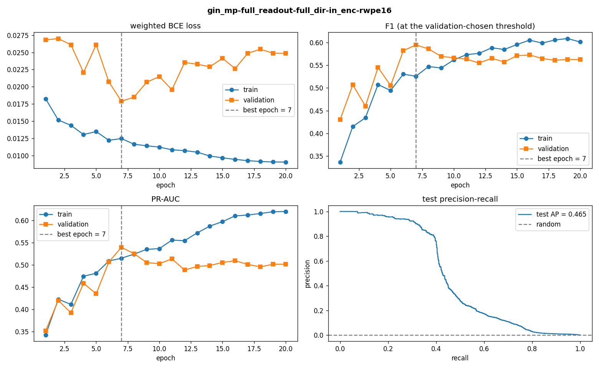

#### 7.5.3 GAT-5 + RWPE · base / base+GFP · rwpe16

Best epoch 15 · threshold 0.495 · params 118,017 · 84 s / epoch · `Outputs/RWPE/GAT/gat_mp-base_readout-full_dir-in_enc-rwpe16/`

| Split | F1 | Precision | Recall | PR-AUC | ROC-AUC | Precision@5 % | Recall@5 % |
|---|---|---|---|---|---|---|---|
| train | 0.473 | 0.566 | 0.407 | 0.428 | 0.985 | 0.0133 | 0.880 |
| val | 0.572 | 0.723 | 0.473 | 0.515 | 0.982 | 0.0185 | 0.868 |
| test | **0.513** | 0.624 | 0.435 | 0.469 | 0.979 | 0.0193 | 0.856 |

- The only run above the tie band: validation F1 0.572 vs 0.550 for GAT-5 (+0.022); on test 0.513 vs 0.500 (+0.013), with recall up (0.435 vs 0.383) and precision down (0.624 vs 0.720) at a lower threshold (0.495 vs 0.603).
- No overfitting: validation loss flat from epoch 12, train PR-AUC (0.43) below validation (0.52) throughout. It converged by epoch 15, whereas GAT-5 was still improving at epoch 20, so part of the gap may be convergence rather than the encoding.
- Triggers the k = 8 rule for GAT config 5 (§7.5.9).

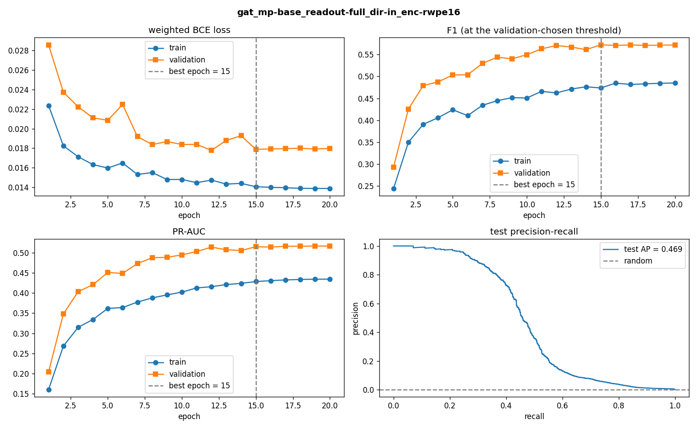

#### 7.5.4 GAT-4 + RWPE · base+GFP / base+GFP · rwpe16

Best epoch 17 · threshold 0.555 · params 133,633 · 145 s / epoch · `Outputs/RWPE/GAT/gat_mp-full_readout-full_dir-in_enc-rwpe16/`

| Split | F1 | Precision | Recall | PR-AUC | ROC-AUC | Precision@5 % | Recall@5 % |
|---|---|---|---|---|---|---|---|
| train | 0.510 | 0.663 | 0.414 | 0.467 | 0.987 | 0.0136 | 0.900 |
| val | 0.569 | 0.797 | 0.443 | 0.519 | 0.982 | 0.0185 | 0.866 |
| test | **0.502** | 0.681 | 0.398 | 0.460 | 0.977 | 0.0189 | 0.842 |

- Exact tie with GAT-4 on validation (0.569 vs 0.570); test 0.502 vs 0.488 (+0.014, inside noise), precision up (0.681 vs 0.611), recall down (0.398 vs 0.406).
- No overfitting, like every GATv2 run: validation loss flat from epoch 5, train PR-AUC below validation to the end (0.47 vs 0.52).

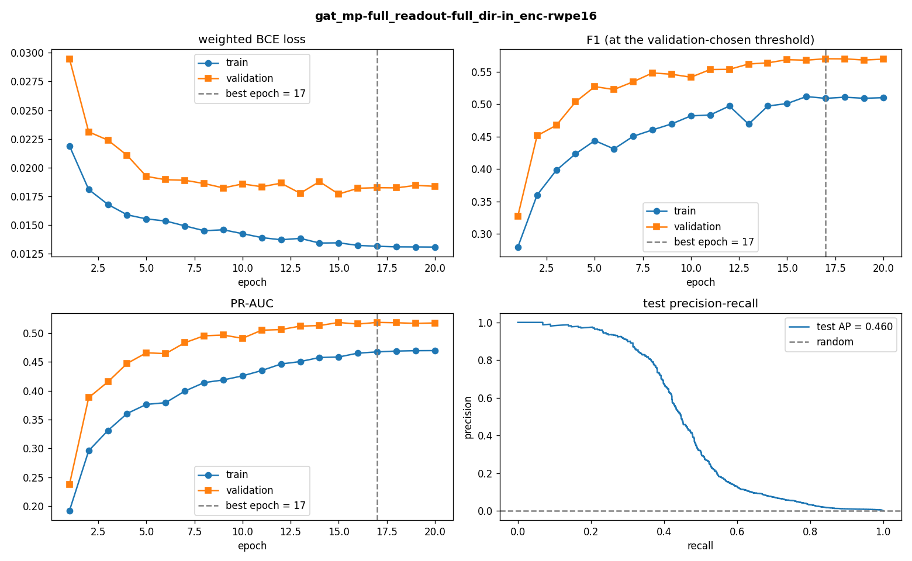

#### 7.5.5 PNA-5 + RWPE · base / base+GFP · rwpe16

Best epoch 17 · threshold 0.710 · params 609,537 · 183 s / epoch · `Outputs/RWPE/PNA/pna_mp-base_readout-full_dir-in_enc-rwpe16/`

| Split | F1 | Precision | Recall | PR-AUC | ROC-AUC | Precision@5 % | Recall@5 % |
|---|---|---|---|---|---|---|---|
| train | 0.601 | 0.833 | 0.471 | 0.579 | 0.992 | 0.0142 | 0.940 |
| val | 0.649 | 0.856 | 0.523 | 0.613 | 0.986 | 0.0188 | 0.884 |
| test | **0.610** | 0.786 | 0.498 | 0.578 | 0.986 | 0.0200 | 0.887 |

- Tie with PNA-5 everywhere: validation 0.650 vs 0.648, test 0.610 vs 0.611, PR-AUC within 0.005, the same threshold (0.71).
- Clean curves: validation loss lowest at the checkpoint (epoch 17), train PR-AUC below validation (0.586 vs 0.601).

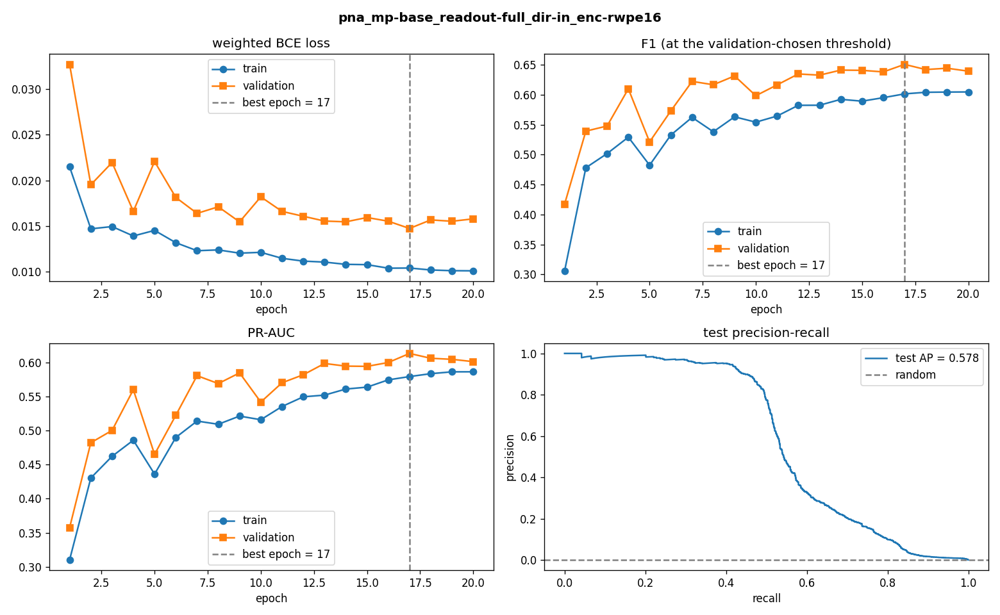

#### 7.5.6 PNA-4 + RWPE · base+GFP / base+GFP · rwpe16

Best epoch 9 · threshold 0.628 · params 625,153 · 230 s / epoch · `Outputs/RWPE/PNA/pna_mp-full_readout-full_dir-in_enc-rwpe16/`

| Split | F1 | Precision | Recall | PR-AUC | ROC-AUC | Precision@5 % | Recall@5 % |
|---|---|---|---|---|---|---|---|
| train | 0.574 | 0.749 | 0.465 | 0.542 | 0.991 | 0.0139 | 0.924 |
| val | 0.644 | 0.842 | 0.521 | 0.591 | 0.984 | 0.0185 | 0.866 |
| test | **0.607** | 0.776 | 0.498 | 0.569 | 0.985 | 0.0200 | 0.886 |

- Tie with PNA-4 (validation 0.644 vs 0.648; test 0.607 vs 0.617); precision lower (0.776 vs 0.856) and recall higher (0.498 vs 0.482) at a lower threshold (0.628 vs 0.699).
- Mild overfitting as in PNA-4: validation loss lowest at epoch 9 (0.0155) and up to 0.019 by epoch 20; train PR-AUC crosses validation at epoch 15 and ends 0.62 vs 0.58. The checkpoint sits at epoch 9, six epochs earlier than PNA-4's.

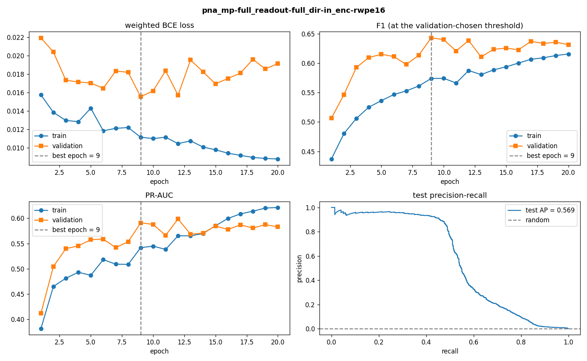

#### 7.5.7 TR-5 + RWPE · base / base+GFP · rwpe16

Best epoch 18 · threshold 0.654 · params 183,553 · 84 s / epoch · `Outputs/RWPE/TRANSFORMER/transformer_mp-base_readout-full_dir-in_enc-rwpe16/`

| Split | F1 | Precision | Recall | PR-AUC | ROC-AUC | Precision@5 % | Recall@5 % |
|---|---|---|---|---|---|---|---|
| train | 0.575 | 0.788 | 0.453 | 0.548 | 0.991 | 0.0139 | 0.924 |
| val | 0.624 | 0.855 | 0.491 | 0.576 | 0.983 | 0.0183 | 0.860 |
| test | **0.592** | 0.794 | 0.472 | 0.560 | 0.984 | 0.0198 | 0.878 |

- Tie with TR-5 (validation 0.624 vs 0.629; test 0.592 vs 0.598); test PR-AUC and Recall@5 % slightly higher (0.560 vs 0.553, 0.878 vs 0.871), precision lower (0.794 vs 0.832).
- No overfitting: validation loss flat from epoch 9, train PR-AUC below validation throughout (0.549 vs 0.574); checkpoint at epoch 18, four epochs later than TR-5.

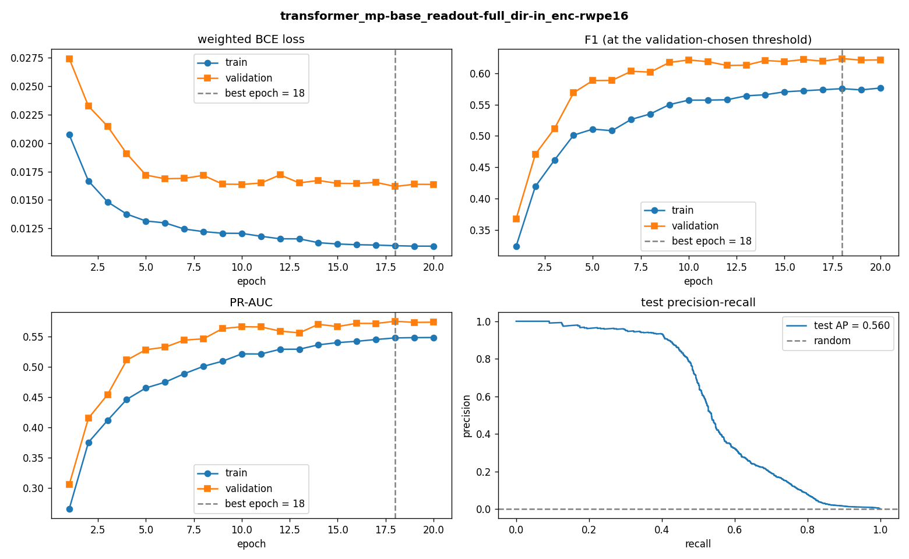

#### 7.5.8 TR-4 + RWPE · base+GFP / base+GFP · rwpe16

Best epoch 11 · threshold 0.655 · params 199,169 · 138 s / epoch · `Outputs/RWPE/TRANSFORMER/transformer_mp-full_readout-full_dir-in_enc-rwpe16/`

| Split | F1 | Precision | Recall | PR-AUC | ROC-AUC | Precision@5 % | Recall@5 % |
|---|---|---|---|---|---|---|---|
| train | 0.583 | 0.769 | 0.469 | 0.567 | 0.992 | 0.0141 | 0.936 |
| val | 0.636 | 0.846 | 0.509 | 0.583 | 0.983 | 0.0184 | 0.863 |
| test | **0.614** | 0.817 | 0.492 | 0.575 | 0.985 | 0.0200 | 0.890 |

- Tie with TR-4 on validation (0.636 vs 0.644); the highest test F1 of the eight RWPE runs (0.614 vs 0.602 for TR-4) with the best test PR-AUC (0.575) and Recall@5 % (0.890) of the batch — all inside single-seed noise.
- Mild overfitting as in TR-4: validation loss lowest at epoch 5, train PR-AUC crosses validation at epoch 12 and ends 0.606 vs 0.576; validation F1 stays flat at 0.63–0.64, so the checkpoint at epoch 11 is unaffected.

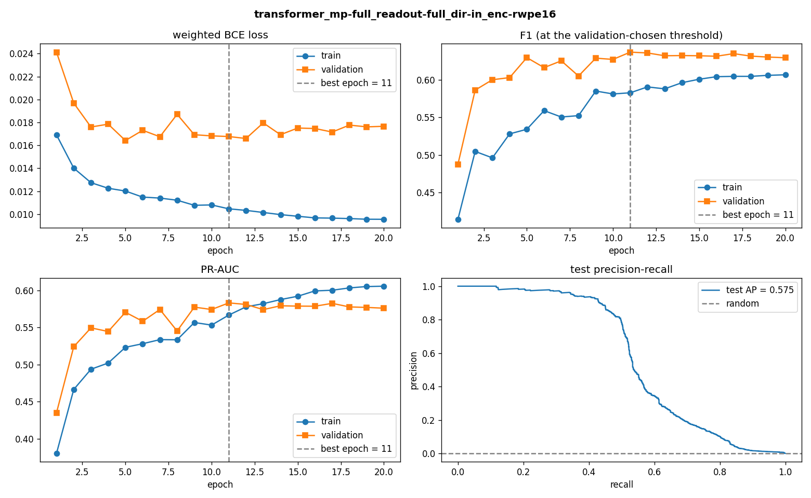

#### 7.5.9 With vs without RWPE — verdict

Validation F1 decides (gap < 0.02 = tie); test shown for completeness.

| Run | F1 val without | F1 val with | Δ val | Verdict (rule) | F1 test without | F1 test with | best epoch without / with | Overfitting without / with |
|---|---|---|---|---|---|---|---|---|
| GIN-5 | 0.609 | 0.598 | -0.011 | tie | 0.525 | 0.486 | 8 / 16 | no / mild |
| GIN-4 | 0.598 | 0.594 | -0.004 | tie | 0.512 | 0.519 | 10 / 7 | yes / yes |
| GAT-5 | 0.550 | 0.572 | +0.022 | uplift (> 0.02) → k = 8 run | 0.500 | 0.513 | 20 / 15 | no / no |
| GAT-4 | 0.570 | 0.569 | -0.000 | tie | 0.488 | 0.502 | 19 / 17 | no / no |
| PNA-5 | 0.648 | 0.649 | +0.001 | tie | 0.611 | 0.610 | 15 / 17 | no / no |
| PNA-4 | 0.648 | 0.644 | -0.004 | tie | 0.617 | 0.607 | 15 / 9 | mild / mild |
| TR-5 | 0.629 | 0.624 | -0.005 | tie | 0.598 | 0.592 | 14 / 18 | no / no |
| TR-4 | 0.644 | 0.636 | -0.008 | tie | 0.602 | 0.614 | 15 / 11 | mild / mild |

**GIN: without vs with RWPE, all metrics, all splits**

| Run | Split | F1 | Precision | Recall | PR-AUC | ROC-AUC | Precision@5 % | Recall@5 % |
|---|---|---|---|---|---|---|---|---|
| GIN-5 | train | 0.534 | 0.666 | 0.445 | 0.482 | 0.986 | 0.0134 | 0.886 |
| GIN-5 | val | 0.609 | 0.820 | 0.484 | 0.549 | 0.982 | 0.0184 | 0.864 |
| GIN-5 | test | 0.525 | 0.678 | 0.429 | 0.484 | 0.980 | 0.0195 | 0.867 |
| GIN-5 + RWPE | train | 0.572 | 0.786 | 0.449 | 0.535 | 0.990 | 0.0139 | 0.922 |
| GIN-5 + RWPE | val | 0.598 | 0.865 | 0.457 | 0.536 | 0.981 | 0.0181 | 0.851 |
| GIN-5 + RWPE | test | 0.486 | 0.765 | 0.356 | 0.435 | 0.972 | 0.0183 | 0.815 |
| GIN-4 | train | 0.563 | 0.692 | 0.475 | 0.546 | 0.991 | 0.0140 | 0.928 |
| GIN-4 | val | 0.598 | 0.831 | 0.467 | 0.538 | 0.979 | 0.0178 | 0.837 |
| GIN-4 | test | 0.512 | 0.743 | 0.390 | 0.479 | 0.974 | 0.0186 | 0.827 |
| GIN-4 + RWPE | train | 0.526 | 0.598 | 0.469 | 0.515 | 0.986 | 0.0135 | 0.896 |
| GIN-4 + RWPE | val | 0.594 | 0.822 | 0.465 | 0.540 | 0.980 | 0.0182 | 0.853 |
| GIN-4 + RWPE | test | 0.519 | 0.738 | 0.401 | 0.465 | 0.974 | 0.0187 | 0.831 |

**GATv2: without vs with RWPE, all metrics, all splits**

| Run | Split | F1 | Precision | Recall | PR-AUC | ROC-AUC | Precision@5 % | Recall@5 % |
|---|---|---|---|---|---|---|---|---|
| GAT-5 | train | 0.475 | 0.679 | 0.365 | 0.424 | 0.985 | 0.0132 | 0.878 |
| GAT-5 | val | 0.550 | 0.814 | 0.416 | 0.498 | 0.982 | 0.0185 | 0.866 |
| GAT-5 | test | 0.500 | 0.720 | 0.383 | 0.451 | 0.980 | 0.0192 | 0.851 |
| GAT-5 + RWPE | train | 0.473 | 0.566 | 0.407 | 0.428 | 0.985 | 0.0133 | 0.880 |
| GAT-5 + RWPE | val | 0.572 | 0.723 | 0.473 | 0.515 | 0.982 | 0.0185 | 0.868 |
| GAT-5 + RWPE | test | 0.513 | 0.624 | 0.435 | 0.469 | 0.979 | 0.0193 | 0.856 |
| GAT-4 | train | 0.507 | 0.597 | 0.441 | 0.477 | 0.988 | 0.0137 | 0.906 |
| GAT-4 | val | 0.570 | 0.765 | 0.454 | 0.512 | 0.981 | 0.0182 | 0.856 |
| GAT-4 | test | 0.488 | 0.611 | 0.406 | 0.458 | 0.978 | 0.0189 | 0.841 |
| GAT-4 + RWPE | train | 0.510 | 0.663 | 0.414 | 0.467 | 0.987 | 0.0136 | 0.900 |
| GAT-4 + RWPE | val | 0.569 | 0.797 | 0.443 | 0.519 | 0.982 | 0.0185 | 0.866 |
| GAT-4 + RWPE | test | 0.502 | 0.681 | 0.398 | 0.460 | 0.977 | 0.0189 | 0.842 |

**PNA: without vs with RWPE, all metrics, all splits**

| Run | Split | F1 | Precision | Recall | PR-AUC | ROC-AUC | Precision@5 % | Recall@5 % |
|---|---|---|---|---|---|---|---|---|
| PNA-5 | train | 0.587 | 0.819 | 0.458 | 0.560 | 0.991 | 0.0140 | 0.927 |
| PNA-5 | val | 0.648 | 0.872 | 0.516 | 0.610 | 0.986 | 0.0188 | 0.883 |
| PNA-5 | test | 0.611 | 0.800 | 0.494 | 0.574 | 0.986 | 0.0201 | 0.892 |
| PNA-5 + RWPE | train | 0.601 | 0.833 | 0.471 | 0.579 | 0.992 | 0.0142 | 0.940 |
| PNA-5 + RWPE | val | 0.649 | 0.856 | 0.523 | 0.613 | 0.986 | 0.0188 | 0.884 |
| PNA-5 + RWPE | test | 0.610 | 0.786 | 0.498 | 0.578 | 0.986 | 0.0200 | 0.887 |
| PNA-4 | train | 0.598 | 0.839 | 0.464 | 0.585 | 0.993 | 0.0144 | 0.956 |
| PNA-4 | val | 0.648 | 0.894 | 0.508 | 0.606 | 0.985 | 0.0185 | 0.870 |
| PNA-4 | test | 0.617 | 0.856 | 0.482 | 0.575 | 0.984 | 0.0200 | 0.888 |
| PNA-4 + RWPE | train | 0.574 | 0.749 | 0.465 | 0.542 | 0.991 | 0.0139 | 0.924 |
| PNA-4 + RWPE | val | 0.644 | 0.842 | 0.521 | 0.591 | 0.984 | 0.0185 | 0.866 |
| PNA-4 + RWPE | test | 0.607 | 0.776 | 0.498 | 0.569 | 0.985 | 0.0200 | 0.886 |

**Graph Transformer: without vs with RWPE, all metrics, all splits**

| Run | Split | F1 | Precision | Recall | PR-AUC | ROC-AUC | Precision@5 % | Recall@5 % |
|---|---|---|---|---|---|---|---|---|
| TR-5 | train | 0.569 | 0.813 | 0.438 | 0.538 | 0.990 | 0.0139 | 0.923 |
| TR-5 | val | 0.629 | 0.893 | 0.485 | 0.577 | 0.984 | 0.0185 | 0.867 |
| TR-5 | test | 0.598 | 0.832 | 0.466 | 0.553 | 0.983 | 0.0196 | 0.871 |
| TR-5 + RWPE | train | 0.575 | 0.788 | 0.453 | 0.548 | 0.991 | 0.0139 | 0.924 |
| TR-5 + RWPE | val | 0.624 | 0.855 | 0.491 | 0.576 | 0.983 | 0.0183 | 0.860 |
| TR-5 + RWPE | test | 0.592 | 0.794 | 0.472 | 0.560 | 0.984 | 0.0198 | 0.878 |
| TR-4 | train | 0.597 | 0.814 | 0.471 | 0.587 | 0.993 | 0.0144 | 0.955 |
| TR-4 | val | 0.644 | 0.879 | 0.508 | 0.588 | 0.981 | 0.0182 | 0.854 |
| TR-4 | test | 0.602 | 0.788 | 0.487 | 0.574 | 0.983 | 0.0198 | 0.881 |
| TR-4 + RWPE | train | 0.583 | 0.769 | 0.469 | 0.567 | 0.992 | 0.0141 | 0.936 |
| TR-4 + RWPE | val | 0.636 | 0.846 | 0.509 | 0.583 | 0.983 | 0.0184 | 0.863 |
| TR-4 + RWPE | test | 0.614 | 0.817 | 0.492 | 0.575 | 0.985 | 0.0200 | 0.890 |

**The GIN pair run twice** (same configuration and seed, two Kaggle sessions):

| Run (seed 42) | val F1 4 Oct | val F1 5 Oct | test F1 4 Oct | test F1 5 Oct | best epoch 4 Oct / 5 Oct |
|---|---|---|---|---|---|
| GIN-5 + RWPE | 0.600 | 0.598 | 0.524 | 0.486 | 14 / 16 |
| GIN-4 + RWPE | 0.589 | 0.594 | 0.501 | 0.519 | 16 / 7 |

- **Rule outcome:** seven of the eight runs are ties (validation gaps of 0.011 or less). GAT-5 + RWPE is +0.022, just over the 0.02 line, so by the rule fixed in advance one k = 8 run follows on GAT config 5 (`rwpe8`, about 30 min); k = 8 is kept only if it ties with k = 16. For GIN, PNA and the Transformer RWPE is a null result and nothing further runs.
- **Reading:** this matches §2 — the directed RWPE is non-zero for under 2 % of accounts, and GFP at the readout already encodes the cycles those accounts sit on. The operators that extract the most from the graph on their own (PNA, Transformer) gain nothing; GATv2, the operator that profits least from edge features (§7.2), is the only one with a hint of a gain, and it came as higher recall at a lower threshold rather than better ranking (validation PR-AUC 0.515 vs 0.498).
- **Overfitting is unchanged by RWPE:** config 4 overfits for GIN, PNA and the Transformer with or without it (the checkpoints move earlier, to epochs 7, 9 and 11), config 5 does not, and GATv2 never does. The one exception is GIN-5 + RWPE, which shows a mild drift GIN-5 lacked.
- **Seed noise, measured:** the GIN pair was trained twice with the same seed (4 Oct preliminary session, 5 Oct full session; GPU non-determinism). Validation F1 moved by at most 0.005, test F1 by up to 0.04 — the 0.02 validation tie band holds, and test gaps under about 0.04 mean nothing for a single seed. The 4 Oct files are superseded (kept in git history, commit 4fcb616).
- **Caveat:** on val/test the RWPE of an account also reflects edges later than the seed edge (§2); the leakage check showed that only about 40 % of the laundering edges flagged by a non-zero RWPE stay flagged without those later edges, so the snapshot RWPE is if anything optimistic — which makes the null result the safer conclusion.
- **Runtime (from the history logs):** 21–77 min per run, 5.9 h for the batch; PNA-4 + RWPE slowest at 230 s per epoch, GIN-5 + RWPE fastest at 63 s.

## 8 · Repository map

| File | Content |
|---|---|
| `EDA.ipynb` | exploratory analysis, USD conversion, findings behind the feature design |
| `Data_preparation.ipynb` | truncation, features, GFP, split, normalization, graph snapshots |
| `GFP_experiments.ipynb` | the data-tuned GFP sheet `tuned` next to V0: evidence from the 370 annotated attempts, parameters, WSL run, causality / alignment checks, label correlations |
| `Data_checks.ipynb` | 59 verification checks over every artifact (incl. the tuned sheet) |
| `gnn_core.py` | shared code for every operator: fixed model template, `build_model(operator, …)`, loaders, training loop with validation threshold sweep, metrics on all splits, curves, saving, `invariant_params()` |
| `GIN_fixed_architecture.ipynb` | the Kaggle notebook of the GIN family: config cell (7 runs) + loop over `gnn_core.py`; `GAT_fixed_architecture.ipynb` is the same notebook for GATv2 (only the config cell differs) |
| `PNA_fixed_architecture.ipynb` / `TRANSFORMER_fixed_architecture.ipynb` | the same notebook for PNA and for the graph transformer (only the config cell differs); results in §7.3 and §7.4 |
| `RWPE_encoding.ipynb` / `rwpe_compute.py` | RWPE node encoding per snapshot (toy sanity test against PyG `AddRandomWalkPE`, edge-list check against the graph files, self-loop tables, per-step time / RAM / fill-in log, checks, diagnostics, value scale); the script does the exact scipy computation, CPU only, locally or on Kaggle → `Data/rwpe/rwpe_k{8,16}_{train,val,test}.pt` |
| `RWPE_fixed_architecture.ipynb` | the same Kaggle notebook for the node-encoding runs of §7.5: config entries carry `operator` and `node_enc` (all eight runs in one session), RWPE files from the Kaggle dataset `hi-small-rwpe`; summary `batch_summary_rwpe.csv` per family |
| `run_gfp_wsl.py` | causal batched GFP bridge (Windows snapml lacks GFP → runs in WSL) |
| `Progress_Report.md` / `EXPERIMENTS.md` | markdown mirrors of this page (with the reference list) and of the experiments page — Notion is the main copy |
| `Outputs/<FAMILY>/<run>/` (GIN, GAT, PNA, TRANSFORMER) | results.json (all splits, all metrics), history.csv, curves.png, best.pt, predictions.csv (the last two not versioned) • batch_summary.csv per batch |
| `Outputs/RWPE/<FAMILY>/<run>/` | the same files for the node-encoding runs (§7.5) • batch_summary_rwpe.csv per family |
| `Data/rwpe/` (not versioned) | `rwpe_k{8,16}_{train,val,test}.pt` (float32 [515,070, k]) + per-step logs; uploaded to Kaggle as the dataset `hi-small-rwpe` |

---

## References

1. **E. Altman, J. Blanuša, L. von Niederhäusern, B. Egressy, A. Anghel, K. Atasu.** *Realistic Synthetic Financial Transactions for Anti-Money Laundering Models.* NeurIPS 2023 Datasets and Benchmarks. arXiv:2306.16424. (Local copy: `AML_GNN_GMA/Papers/2306.16424v3.pdf`.)
2. **IBM Transactions for Anti-Money Laundering (AML)** — Kaggle dataset by E. Altman. https://www.kaggle.com/datasets/ealtman2019/ibm-transactions-for-anti-money-laundering-aml
3. **E. Altman**, Kaggle discussion #427517 — on the 10-day real-data span of the Small datasets and the laundering-only tail days. https://www.kaggle.com/datasets/ealtman2019/ibm-transactions-for-anti-money-laundering-aml/discussion/427517
4. **Snap ML — Graph Feature Preprocessor documentation.** IBM. https://snapml.readthedocs.io/en/latest/graph_preprocessor.html
5. **J. Blanuša et al.** Graph feature preprocessing / subgraph-pattern extraction underlying GFP (cycle enumeration and graph pattern mining papers cited as [12, 13, 48, 49] in [1]).
6. **IBM Multi-GNN reference implementation** (GIN+EU, PNA baselines for this dataset). https://github.com/IBM/Multi-GNN
7. **yfinance** — Yahoo Finance market data downloader used for day-specific FX rates. https://github.com/ranaroussi/yfinance
8. **K. Xu, W. Hu, J. Leskovec, S. Jegelka.** *How Powerful are Graph Neural Networks?* ICLR 2019 (GIN). GINE edge term: **W. Hu et al.**, *Strategies for Pre-training Graph Neural Networks*, ICLR 2020.
9. **S. Brody, U. Alon, E. Yahav.** *How Attentive are Graph Attention Networks?* ICLR 2022 (GATv2).
10. **G. Corso, L. Cavalleri, D. Beaini, P. Liò, P. Veličković.** *Principal Neighbourhood Aggregation for Graph Nets.* NeurIPS 2020 (PNA).
11. **Y. Shi, Z. Huang, S. Feng, H. Zhong, W. Wang, Y. Sun.** *Masked Label Prediction: Unified Message Passing Model for Semi-Supervised Classification.* IJCAI 2021 (`TransformerConv`).
